# Binary ReCode C++23 Architecture

**Status:** architecture specification; implementation is maintained under `core`, `runtime`, `services`, and `bindings`.

**Scope:** the autonomous C++23 implementation under `this project`. This document maps the proposed service-platform architecture onto the current repository and the original Ghidra sources. It is deliberately implementation-oriented: names, ownership, revisions, synchronization boundaries, persistence rules, and migration boundaries are specified so that later implementation work does not require recreating these architectural decisions.

**Implementation update:** the migration described here has been applied. The former feature source, test, CLI, and fixture trees now live under `services/*`; there is no `features` directory or CMake subtree. All current repository links in this document use service-owned paths.

## 1. Executive Conclusion

The implementation now uses the conceptual service-platform tree. The historical migration source was a collection of feature libraries, which has been relocated into service-owned targets:

- `services/sleigh` is the compiled-SLA decoder service and owns the migrated native Sleigh source/tests/resources.
- `services/decompiler` is the broad native decompiler service with a provider facade and contract adapter.
- `services/function_id` contains the autonomous FID parser, hasher, query implementation, and tests.
- `services/pe_loader` contains the substantial value-oriented PE model/parser and service contract adapter.
- `services/analyzers` contains all migrated analyzer ports and fixtures; orchestration is owned by `runtime/analysis`.
- `services/debugger/win_dbg_eng` implements the generic debugger contract for Windows DbgEng while keeping its engine thread and native callbacks private.
- `core`, `services`, `runtime`, and `bindings` are the active architectural layers.
- `services/analyzers/shared/src/analyzer_context.cppm` remains an internal compatibility context for the migrated parity suite; new runtime-facing services use canonical snapshots/contracts.

The final architecture therefore needs **consolidation and extraction**, not a wholesale rewrite of the algorithms:

1. Define a small canonical value domain in `core/domain`. It must contain address-space-aware values, bytes, p-code, instructions, references, functions, memory regions, symbols, signatures, and data-type descriptors, but not a `Program` aggregate or service logic.
2. Extract stable contracts into `core/contracts`. Services consume immutable providers and return values or mutation proposals. Runtime implementations remain outside the contracts.
3. Compile one shared internal translation substrate for the original Ghidra native classes used by both Sleigh and the decompiler. Do not retain two copies of `address`, `space`, `translate`, `loadimage`, `globalcontext`, `marshal`, `opcodes`, and raw varnode concepts.
4. Keep PE parsing, Sleigh translation, FID matching, decompilation, and individual analyzers as services. The native Ghidra algorithms remain service implementation details behind canonical contracts.
5. Move analyzer registration and scheduling into `runtime/analysis`; keep analyzer implementations in `services/analyzers`. Replace direct mutation of `AnalysisContext` incrementally with immutable snapshots and typed mutation commands.
6. Treat commands, transient responses, and persistent domain events as three different things. Only significant state changes are persisted.
7. Make one append-only event log the source of history and a conventional projection the current query model. Use SQLite for the initial projection and keep it replaceable behind storage contracts.
8. Use one runtime-owned worker pool with project-aware fairness and service priorities. Synchronous APIs remain available for small decode/query operations; expensive decompilation, bulk translation, FID fan-out, and large analysis are queued tasks.
9. Put `Project` in runtime because it owns lifecycle, event log, projection, resources, caches, and services. Keep project-independent value types and contracts in core.
10. Expose one public C++ facade above runtime. Python, JavaScript, and Go bindings depend on that facade and never become dependencies of core, services, or runtime.

The most important correction is that the current `AnalysisContext` must not become the final equivalent of Ghidra's `ProgramDB`. Its useful validation algorithms and Ghidra compatibility rules should be retained, but its state must be split into an event writer, a projection, immutable query snapshots, and service-specific caches.

## 2. Evidence Inspected

### 2.1 Current ReCode implementation

The following current files and build descriptions were inspected:

| Area | Current evidence | Architectural significance |
| --- | --- | --- |
| Build root | `CMakeLists.txt` | The build currently adds only `features`, then links `hello_feature`, the decompiler frontend, and the analyzer aggregate into `recode_app`. No core/runtime graph exists. |
| Sleigh | `services/sleigh/CMakeLists.txt`, `sleigh_runtime.cppm`, `sleigh_runtime_adapter.cppm`, and `src/*.cppm` (including `types.cppm`, `compression.cppm`, and `internal.cppm`) | The decoder owns compiled SLA state and adapts native `ghidra::Sleigh` callbacks to value results. The low-level port is currently self-contained but overlaps the decompiler port. |
| Decompiler | `services/decompiler/CMakeLists.txt`, `src/decompiler.cppm`, `src/decompiler_impl.cppm`, and the implementation modules listed there | The native engine is broad and algorithmically substantial. `decompiler.cppm` already exposes provider abstractions for memory, p-code, symbols, types, prototypes, comments, variables, flow, functions, and injections. |
| PE | `services/pe_loader/src/pe_loader.cppm` | The parser has checked RVA/VA/file-offset translation, sections, imports, exports, relocations, debug data, TLS, runtime functions, resources, and a move-only `LoadedPeImage`. It is a service-specific parser whose result can feed a generic image domain. |
| FID | `services/function_id/src/function_id.cppm`, `types.cppm`, `database.cppm`, `hasher.cppm`, `storage_helpers.cppm`, `buffer_file.cppm`, `parse_exception.cppm` | The FID implementation is already separated into parser, database, hash, and public aggregate boundaries. Current analyzer-side database loading uses `std::async`, which must be routed through the shared runtime pool. |
| Analyzer model | `services/analyzers/shared/src/analyzer_types.cppm` | This file currently defines `Address` as `std::uint64_t` and contains nearly all listing, function, reference, data, symbol, PDB, archive, bookmark, fact, option, event, and result types. It is the first extraction source for core/domain, not the final location. |
| Analyzer state | `services/analyzers/shared/src/analyzer_context.cppm` | `AnalysisContext` owns `pe::LoadedPeImage`, `sleigh_runtime::Decoder`, processor context, options, every mutable analysis collection, event queue, sequence counter, recursion guard, and disassembly limit. This is the principal architectural seam to split. |
| Analyzer scheduler | `services/analyzers/shared/src/analyzer.cppm`, `analyzer_manager.cppm`, `analyzer_registry.cppm`, `analyzer_base.cppm`, `analyzer_cancellation_token.cppm` | The umbrella re-exports the split modules. The manager preserves lower-number-first priority, event-kind triggers, coalescing, cancellation, and prerequisite checks. It is a good behavior baseline but belongs in runtime and currently assumes a single mutable context. |
| Analyzer registrations | `services/analyzers/analyzer_builtin.cpp` and each analyzer directory | The current built-in pipeline contains ports for disassembly, function starts, references, data, strings, PE/PDB, Function ID, decompiler analyses, stack, and other analyzers. Implementations should remain service modules while scheduling moves. |
| Tests | `services/*/tests`, analyzer test support and fixtures | Tests are feature-local and use GoogleTest. They define important compatibility behavior, including checked PE parsing, SLA decoding, FID hashes, provider validation, function body carving, analyzer priority, cancellation, and repeat-analysis stability. |
| Documentation | `services/*/README.md`, analyzer README files, and analyzer-local `GHIDRA_PORT.md` files | Existing port evidence must remain linked from future module `README.md` and `GHIDRA_PORT.md` files. This document is architecture guidance, not a replacement for feature-specific port evidence. |

There is no current `framework` directory. The current shared framework is effectively the analyzer shared library. There is also no current project, event store, event bus, projection, dispatcher, public C++ facade, or language binding layer.

Current executable sources are also migration inputs rather than final service APIs:

| Current executable | Current role | Final role |
| --- | --- | --- |
| `src/main.cpp` | Current application entry point linked by `recode_app` | `apps/cli/main.cppm` or a composition root that constructs the public C++ facade; it must not link feature internals directly. |
| `services/sleigh/cli/sleigh_runtime_decode.cppm` | Standalone SLA decoder diagnostic | `apps/cli` command using `IPCodeDecoder`/C++ facade; retain as a focused diagnostic during migration. |
| `services/decompiler/cli/decompiler_cli.cppm` | Standalone decompiler CLI | `apps/cli` decompile command using dispatcher task/status APIs. |
| `services/function_id/cli/function_id_cli.cppm` | Raw bytes/SLA/FID database diagnostic | `apps/cli` FID command using the service/facade; preserve raw fixture grammar. |

Current CMake deliberately differs by subsystem: Sleigh collects `src/*.cppm` with a glob, while the decompiler uses an explicit synchronized source list. The final build must use explicit module lists for public/core/runtime targets and keep any glob limited to a documented private native partition if necessary. Each final feature/library target has a matching focused test target registered with CTest; runtime/replay/projection integration tests are additional targets, not replacements for feature tests.

The current `vcpkg.json` declares `gtest`, `pugixml`, and `zlib`. SQLite is not yet a dependency and must be added through vcpkg when the projection implementation is introduced, never by vendoring or hand-copying a third-party library. The CMake target should consume the package's exported SQLite target resolved by the selected vcpkg toolchain; the target name must be verified against the installed port during implementation. `GHIDRA_INSTALL_DIR` remains the only documented environment variable and is used for original Ghidra/PyGhidra oracles, not hard-coded by the C++ runtime. No project-specific environment variable is required for the event log/projection.

`framework` is therefore not a second final layer. The final `core` replaces the absent framework directory as the stable vocabulary/contract layer, while `runtime` owns the infrastructure that a framework target would otherwise have owned. If staged migration requires a compatibility CMake target named `ReCode::Framework`, it must be a thin umbrella that re-exports `ReCode::Core` and the event/contract module targets; it must contain no duplicate domain types, database, worker pool, or service implementations. The migration source is `services/analyzers/shared`, especially `analyzer_types.cppm`, `analyzer_base.cppm`, and the pure portions of `analyzer_context.cppm`.

### 2.2 Original Ghidra sources

The important original sources inspected or used as mapping anchors are:

| Concern | Original sources |
| --- | --- |
| Native translation substrate | `Ghidra/Features/Decompiler/src/decompile/cpp/address.hh`, `address.cc`, `space.hh`, `space.cc`, `translate.hh`, `translate.cc`, `loadimage.hh`, `loadimage.cc`, `globalcontext.hh`, `globalcontext.cc`, `marshal.hh`, `marshal.cc`, `opcodes.hh`, `opcodes.cc`, `pcoderaw.hh`, `pcoderaw.cc`, and `error.hh` (the current repository has no `error.cc`) |
| Sleigh engine | `Ghidra/Features/Decompiler/src/decompile/cpp/sleigh.hh`, `sleigh.cc`, `sleighbase.hh`, `sleighbase.cc`, `context.hh`, `context.cc`, `semantics.hh`, `semantics.cc`, `slghsymbol.hh`, `slghsymbol.cc`, `slghpattern.hh`, `slghpattern.cc`, `slghpatexpress.hh`, `slghpatexpress.cc`, `slaformat.hh`, `slaformat.cc`, and related compiler/parser files |
| Native decompiler | `Ghidra/Features/Decompiler/src/decompile/cpp/architecture.hh`/`.cc`, `database.hh`/`.cc`, `funcdata.hh`/`.cc`, `flow.hh`/`.cc`, `block.hh`/`.cc`, `jumptable.hh`/`.cc`, `fspec.hh`/`.cc`, `type.hh`/`.cc`, `varnode.hh`/`.cc`, `op.hh`/`.cc`, `heritage.hh`/`.cc`, `action.hh`/`.cc`, `printlanguage.hh`/`.cc`, `printc.hh`/`.cc`, and the remaining files listed by the current decompiler CMake file |
| Original native build composition | `Ghidra/Features/Decompiler/src/decompile/cpp/Makefile` | The `CORE` object group contains address spaces, translation, load images, p-code, types, XML, and emulation support. `LIBSLA` is `CORE` plus native Sleigh; `LIBDECOMP` is `CORE`, `DECCORE`, extras, and `SLEIGH`. This is direct build evidence that native Decompiler consumes the shared native Sleigh subsystem. |
| Native translation contracts | `Ghidra/Features/Decompiler/src/decompile/cpp/translate.hh`: `PcodeEmit`, `AssemblyEmit`, `AddressResolver`, `Translate`, and address-space abstractions |
| Native load image contract | `Ghidra/Features/Decompiler/src/decompile/cpp/loadimage.hh`: `LoadImage`, `LoadImageFunc`, `LoadImageSection`, `DataUnavailError` |
| Native decompiler provider data | `Ghidra/Features/Decompiler/src/decompile/cpp/database.hh` (symbols/scopes), `type.hh` (types), `fspec.hh` (prototypes/storage/injections), `comment.hh` (comments), `flow.hh` and `jumptable.hh` (flow/jump tables), `pcodeinject.hh` and `inject_ghidra.hh` (call-fixups/injections) |
| Java address model | `Ghidra/Framework/SoftwareModeling/src/main/java/ghidra/program/model/address/Address.java`, `AddressSpace.java`, `AddressRange.java`, `AddressSetView.java`, `AddressSet.java`, `AddressFactory.java` |
| Java listing model | `Ghidra/Framework/SoftwareModeling/src/main/java/ghidra/program/model/listing/Program.java`, `Listing.java`, `Instruction.java`, `Function.java`, `FunctionManager.java`, `CodeUnit.java`, `ProgramContext.java` |
| Java persistent program model | `Ghidra/Framework/SoftwareModeling/src/main/java/ghidra/program/database/ProgramDB.java`, plus `mem/Memory.java`, `address/AddressFactory.java`, `symbol/ReferenceManager.java`, and `symbol/SymbolTable.java` | Original database-backed aggregate being intentionally replaced by event history plus projections. |
| Java p-code model | `Ghidra/Framework/SoftwareModeling/src/main/java/ghidra/program/model/pcode/PcodeOp.java`, `Varnode.java`, and related p-code model classes |
| Java symbols and references | `Ghidra/Framework/SoftwareModeling/src/main/java/ghidra/program/model/symbol/Reference.java`, `ReferenceManager.java`, `Symbol.java`, `SymbolTable.java`, `SourceType.java`, and `FlowType.java` |
| Java data types | `Ghidra/Framework/SoftwareModeling/src/main/java/ghidra/program/model/data/DataType.java`, `DataTypeManager.java`, `FunctionDefinition.java`, `ParameterDefinition.java` |
| Java language and ABI model | `Ghidra/Framework/SoftwareModeling/src/main/java/ghidra/program/model/lang/Language.java`, `CompilerSpec.java`, `Register.java`, `InstructionPrototype.java`, `ProgramArchitecture.java` |
| Java/native decompiler bridge | `Ghidra/Features/Decompiler/src/decompile/cpp/ghidra_translate.hh`/`.cc`, `loadimage_ghidra.hh`/`.cc`, `database_ghidra.hh`/`.cc`, `ghidra_context.hh`, `ghidra_process.hh`, and Java `DecompileCallback.java`, `DecompileProcess.java`, `DecompInterface.java` | Java Program/Sleigh values cross into native code through callbacks and marshaled data, not shared C++ objects. |
| Function ID analyzer | `Ghidra/Features/FunctionID/src/main/java/ghidra/feature/fid/analyzer/FidAnalyzer.java`, `cmd/ApplyFidEntriesCommand.java`, `service/FidProgramSeeker.java`, `service/FidService.java`, `service/FidQueryService.java`, `db/FidDB.java`, `db/FunctionsTable.java`, `db/RelationsTable.java`, `hash/FidHasher.java`, `hash/FunctionExtentGenerator.java`, `hash/MessageDigestFidHasher.java`, and `hash/FunctionBodyFunctionExtentGenerator.java` |
| PE loader | `Ghidra/Features/Base/src/main/java/ghidra/app/util/opinion/Loader.java`, `AbstractProgramLoader.java`, `AbstractProgramWrapperLoader.java`, `PeLoader.java`, `app/util/bin/format/pe/PortableExecutable.java`, `NTHeader.java`, `OptionalHeader.java`, `ImportDataDirectory.java`, `ExportDataDirectory.java`, `BaseRelocationDataDirectory.java`, `ExceptionDataDirectory.java`, `TLSDataDirectory.java`, `ResourceDataDirectory.java`, `SecurityDataDirectory.java`, `DelayImportDataDirectory.java`, `BoundImportDataDirectory.java`, `COMDescriptorDataDirectory.java`, and related PE format classes |
| Analysis scheduler | `Ghidra/Features/Base/src/main/java/ghidra/app/plugin/core/analysis/AutoAnalysisManager.java`, `AnalysisTaskList.java`, `AnalysisScheduler.java`, and `AnalysisTask.java` |
| Program/block contracts | `Ghidra/Framework/SoftwareModeling/src/main/java/ghidra/program/model/block/BasicBlockModel.java`, `SimpleBlockModel.java`, `CodeBlock.java`, `CodeBlockModel.java` |
| Representative analyzers | `Ghidra/Features/Base/src/main/java/ghidra/app/plugin/core/disassembler/EntryPointAnalyzer.java`, `app/plugin/core/function/FunctionAnalyzer.java`, `app/plugin/core/analysis/ConstantPropagationAnalyzer.java`, and corresponding analyzers named in the current analyzer sources and `GHIDRA_PORT.md` files |

The original native files demonstrate that Sleigh is not an unrelated decoder copied beside the decompiler. `Sleigh` derives from `SleighBase`, which derives from `Translate`; both use `Address`, `AddrSpace`, `VarnodeData`, `PcodeEmit`, `LoadImage`, context databases, and p-code opcode definitions that are also consumed by the decompiler. The duplicate current project modules are therefore a real duplication of one original native subsystem, not merely similar names.

This shared-native conclusion must not be confused with the Java model. Original Java Sleigh (`Ghidra/Framework/SoftwareModeling/src/main/java/ghidra/app/plugin/processors/sleigh/SleighLanguage.java` and `SleighInstructionPrototype.java`) shares Java `Address`/`Program` concepts, but the Java side communicates with native decompiler code through `DecompileCallback`/`DecompileProcess` methods such as `getBytes`, `getPcode`, `getComments`, `getMappedSymbols`, `getDataType`, `getRegister`, `getTrackedRegisters`, and `getUserOpName`. The final C++ project has no Java runtime dependency: the native translation engine shares original native semantics internally, while core values replace the serialized Java callback boundary for C++ providers.

### 2.3 Concrete current public APIs and gaps

The following inventory records details that must be preserved during migration.

#### Sleigh public API

`services/sleigh/sleigh_runtime.cppm` exports `OperandKind`, `Operand`, `Operand::HashObject`, `Varnode`, `PcodeOpcode`, `FlowKind`, `PcodeOp`, `FlowInfo`, `ContextValue`, `ProcessorContext`, `Instruction`, `DecodeError`, and `Decoder`. `Decoder` is move-only, constructed from a filesystem SLA path, and exposes:

```cpp
explicit Decoder(std::filesystem::path sla_path);
Result<Instruction, DecodeError> decode(
    std::uint64_t address,
    std::span<const std::uint8_t> bytes,
    const ProcessorContext& context = {});
```

The returned `Instruction` contains raw bytes, instruction mask, mnemonic, operands, flow, and p-code. The adapter translates native `ghidra::AssemblyEmit`, `ghidra::PcodeEmit`, `ghidra::SleighLoadImage`, `ghidra::Address`, and `ghidra::VarnodeData`. The final `IPCodeDecoder` must preserve all of these observable fields while replacing the raw integer address and service-local storage types with core values.

The current implementation is approximately twenty internal C++ modules re-exported through `src/internal.cppm`; it loads compiled SLA files but does not compile `.slaspec` files. Zlib is required for SLA decompression. The focused tests in `services/sleigh/tests/sleigh_runtime_tests.cppm` cover SLA loading, x86-64 decoding, operands, flow, p-code, masks, context values, invalid input, and instruction-window behavior. There is currently no feature-level `GHIDRA_PORT.md` for Sleigh; the final `services/sleigh` module must add one before it is considered a complete port.

#### PE public API

`services/pe_loader/src/pe_loader.cppm` exports PE-specific types including `Machine`, `DosHeader`, `RichHeader`, `CoffHeader`, `OptionalHeader`, `Section`, `MemoryRegion`, `ImportedSymbol`, `ImportDescriptor`, `IatEntry`, `ExportDirectory`, `ExportedSymbol`, `RelocationBlock`, `RelocationEntry`, `DebugDirectoryEntry`, `RuntimeFunction`, `TlsDirectory`, resource/security/bound/delay-import/CLR/COFF records, `LoadOptions`, `ParseStatus`, `ParseError`, `AddressError`, `MemoryError`, `LoadedPeImage`, and `PeLoader`.

`PeLoader::load()`/`load_file()` construct a move-only `LoadedPeImage` with checked header/directory parsing. Its read-only API exposes sections, memory regions, imports, IAT entries, exports, relocations, exception functions, TLS callbacks, resources, debug entries, parse diagnostics, entry point, executable-range queries, RVA/VA/file-offset translations, memory reads, and resource payload reads. Strict and partial parsing are both supported. The final PE service must retain this breadth in `PeLoadDetails`; only generic image facts move to core. The focused `pe_loader_tests.cpp` suite covers malformed/truncated files, PE32/PE32+, mapping, imports, exports, relocations, resources, TLS, exception data, debug data, and partial parsing. There is currently no feature-level `GHIDRA_PORT.md` for PE.

#### Function ID public API

`services/function_id/src/types.cppm` exports `fid::Instruction`, `Relocation`, `HashQuad`, `ProgramInfo`, `FunctionContext`, `LibraryRecord`, `FunctionRecord`, `MatchMode`, `Match`, and `IdentificationResult`, together with error and operand-object values. Its `Instruction` is richer than the analyzer instruction: it carries raw bytes, instruction masks, operand masks, normalized operand objects, call/skip state, and relocation metadata.

`fid::Hasher` implements full/specific Function ID hashes and `hash_sleigh()` conversion. `fid::Database` opens original `.fidb` storage, preserves compressed/B-tree/table layout, supports language/compiler/source filtering, and performs relation-aware identification. These database values are not a second program model; they are immutable external resource records. The final `FunctionIdService` must adapt core instruction/operand/relocation snapshots to this service model and adapt results back to `core::FunctionIdResult`. The focused tests use checked-in `.fidb` fixtures and Sleigh decoding. There is currently no feature-level `GHIDRA_PORT.md` for Function ID.

There are two material current parity gaps that the final service must not hide:

- `services/analyzers/function_id/src/function_id.cppm:145-176` currently constructs `fid::FunctionContext query{*hash, {}, {}}`; it supplies no child or parent hash family. Original `FidProgramSeeker.java:81-202` collects call-graph children and parents, and `FidProgramSeeker.java:284-355` includes those relations in scoring. The final service must expose a `FunctionHashFamily` builder that queries the project reference/function graph and applies the original parent/child relation limits and force-relation rules.
- Current application at `function_id.cppm:101-120` is hard-coded. Original `FidAnalyzer.java:70-81,183-212` and `ApplyFidEntriesCommand.java:110-154,243-267` contain score thresholds, multiple-name handling, trusted/user/imported label conflict policy, bookmark policy, comments, and database filter behavior. Those options belong in `FunctionIdOptions` and the command handler, not in the low-level database parser.

The current library opens and queries existing `.fidb` files but does not implement the original FID service's database creation/ingestion operations (`FidService.java:125-127,191-219,316-318`). The final architecture must either mark FID database creation as a deliberately pending service capability or add a separate `IFunctionIdDatabaseBuilder`; it must not imply that read-only matching is the complete Function ID port.

#### Decompiler public layers

The decompiler has two distinct current APIs:

1. `services/decompiler/src/decompiler.cppm` exports the provider-facing `recode::decompiler` API. It includes `Storage`, `PcodeOperation`, `Instruction`, provider errors/options, symbol/type/prototype/variable/flow/injection descriptions, `ProviderContext`, `ArchitectureDescription`, `FunctionDescription`, `DecompilationResult`, and provider interfaces for p-code, memory, symbols, types, prototypes, comments, variables, flow, functions, and injections. `Decompiler::decompile(FunctionDescription)` returns raw instructions/p-code, high p-code, data flow, control flow, AST output, and generated C.
2. `services/decompiler/src/ghidra_decompiler.cppm` aggregates the large legacy `ghidra` implementation. `decompiler_impl.cppm` adapts the provider API to native `Architecture`, `SleighArchitecture`, `Funcdata`, `Translate`, `LoadImage`, `PcodeEmit`, `PrintC`, `Action`, and `FlowInfo` classes.

The final architecture retains both roles but makes the boundary explicit: the provider-facing types become core/service contract values, while the legacy aggregate is private native implementation. Existing tests include the public/provider suite and native marshal, scalar, type, architecture, metadata, parameter-store, and circle-range suites. There is currently no feature-level `GHIDRA_PORT.md` for the decompiler. `README.md` also contains stale documentation that refers to `fspec.cppm` as missing even though the explicit decompiler CMake source list includes it; migration should correct such documentation rather than treating it as a code gap.

The current analyzer integration does not populate the complete provider surface. `decompiler_parameter_id.cppm:29-125` and `decompiler_switch_analysis.cppm:32-128` supply local memory/p-code adapters through the two-provider constructor. `call_convention_id.cppm:32-210` adds local prototype/symbol adapters but still populates only p-code, memory, prototypes, and symbols. Types, comments, variables, flow, functions, injections, constant formats, and compiler-spec resource identity are not supplied from `AnalysisContext`. `AnalysisContext` also has no general comment collection, variable collection, jump-table/flow-description collection, or injection registry. The final `provider_adapters.cppm` therefore needs to be a complete adapter factory backed by `IProjectQuery`, not merely a shared version of the existing two-provider helper.

#### Analyzer inventory and incomplete behavior

The current built-in registration in `services/analyzers/analyzer_builtin.cpp` contains 34 analyzers. The effective priority order is:

| Priority | Current analyzers |
| ---: | --- |
| 97 | `KnownNoReturnFunctionsAnalyzer` |
| 199 | `FunctionStartPreAnalyzer` |
| 200 | `DisassembleEntryPointsAnalyzer`, `EmbeddedMediaAnalyzer` |
| 301 | `CallFixupInstallerAnalyzer` |
| 302 | `NonReturningFunctionsAnalyzer` |
| 398 | `ExternalEntryReferencesAnalyzer`, `SharedReturnCallsAnalyzer` |
| 399 | `SubroutineReferencesAnalyzer` |
| 402 | `FunctionStartAnalyzer` |
| 498 | `FunctionStartFunctionAnalyzer` |
| 596 | `ConstantPropagationAnalyzer`, `X86ConstantReferenceAnalyzer` |
| 598 | `ScalarOperandReferencesAnalyzer` |
| 600 | `ReferenceAnalyzer` |
| 602 | `DataReferenceAnalyzer` |
| 799 | `FunctionIdAnalyzer` |
| 801 | `ApplyDataArchivesAnalyzer` |
| 897 | `DemanglerMicrosoftAnalyzer` |
| 898 | `PdbUniversalAnalyzer`, `FunctionStartPostAnalyzer`, `FunctionStartDataPostAnalyzer` |
| 899 | `PdbMsdiaAnalyzer`, `CreateAddressTablesAnalyzer` |
| 900 | `CallConventionIdAnalyzer`, `WindowsResourceReferenceAnalyzer` |
| 901 | `AggressiveInstructionFinderAnalyzer`, `DecompilerParameterIdAnalyzer` |
| 902 | `DecompilerSwitchAnalysisAnalyzer` |
| 903 | `StackAnalyzer` |
| 905 | `AsciiStringsAnalyzer`, `CondenseFillerBytesAnalyzer`, `WindowsPeX86PropagateExternalParametersAnalyzer` |
| 1000 | `VariadicFunctionSignatureOverrideAnalyzer` |

Explicit prerequisites cover function-start phases, scalar references, reference analysis, and data references. Many other dependencies are currently expressed only through numeric priorities or assumed existing state. The final scheduler must retain these priorities for compatibility but represent the actual readiness graph explicitly.

Several current analyzers intentionally provide evidence rather than complete original Ghidra mutation:

- `ApplyDataArchivesAnalyzer` validates `.gdt` paths and records archive state because a native datatype manager does not yet exist.
- The built-in `CallFixupInstallerAnalyzer` receives no rules and is effectively inactive by default.
- `VariadicFunctionSignatureOverrideAnalyzer` records a bookmark instead of applying a decompiler call-site signature override.
- PDB and decompiler-dependent analyzers have partial structured output and should not be described as complete equivalents until their command/event contracts can represent the missing changes.
- `non_returning_functions_known` and `non_returning_functions_discovered` are empty CMake scaffolds; they must not be treated as implemented analyzers.

These are port-status facts, not reasons to remove functionality. Each final feature directory must document complete, partial, intentionally different, and pending behavior in its `GHIDRA_PORT.md`.

#### Repeated decompiler adapters

`DecompilerParameterIdAnalyzer` and `DecompilerSwitchAnalysisAnalyzer` each define local `Memory` and `Pcode` provider adapters. `CallConventionIdAnalyzer` additionally defines `ContextMemory`, `ContextPcode`, `ContextPrototype`, and `ContextSymbols`, with repeated x86/x86-64 architecture/register descriptions. These adapters must be consolidated into one project-to-decompiler provider factory under `services/decompiler/provider_adapters.cppm`; analyzer modules should supply only the requested query scope and service-specific options.

Other confirmed duplication that the final tree must account for:

- `pdb_universal.cppm:986-1036` and `pdb_msdia.cppm:304-333` both apply PDB symbols by creating PDB records, symbols, functions, names, and bookmarks. A shared `PdbMutationMapper` should normalize source priority and event batches while keeping MSF/DIA parsing separate.
- `analyzer_context.cppm:476-492` duplicates normal-import and delay-import name normalization/external-symbol insertion. PE import metadata should enter one external-symbol ingestion service.
- `function_id/src/database.cppm:137-177` and analyzer FID code at `function_id.cppm:196-231` maintain independent path/stat-based caches and independent `std::async` loading. The runtime resource manager must own one cache and one worker scheduling path.
- Fixture loaders are repeated across shared analyzer support, aggregate integration tests, PDB tests, and decompiler-analyzer tests. The final test infrastructure should define one project fixture/artifact resolver, while keeping feature-specific fixture contents and tests separate.
- Decompiler data/architecture/provider tests repeat architecture/register/context builders. Those builders should become test-only shared fixtures, not production service dependencies.

The PE boundary is deliberately different from the original Ghidra loader boundary. Current `pe_loader::PeLoader` is a checked parser/value loader. It does not perform original `PeLoader.java` side effects such as creating a `Program`, creating `MemoryBlock` objects, adding labels/external symbols/entry-point functions, applying relocations to program state, or negotiating load specs. In the final system those effects are separate command/event handlers over `PeLoadResult`; the parser remains reusable and testable.

## 3. Architectural Shape

The final system is an in-process service platform. “Service” means a capability with a contract and lifecycle, not an HTTP process. There are no localhost RPC calls, network serialization boundaries, or artificial process isolation.

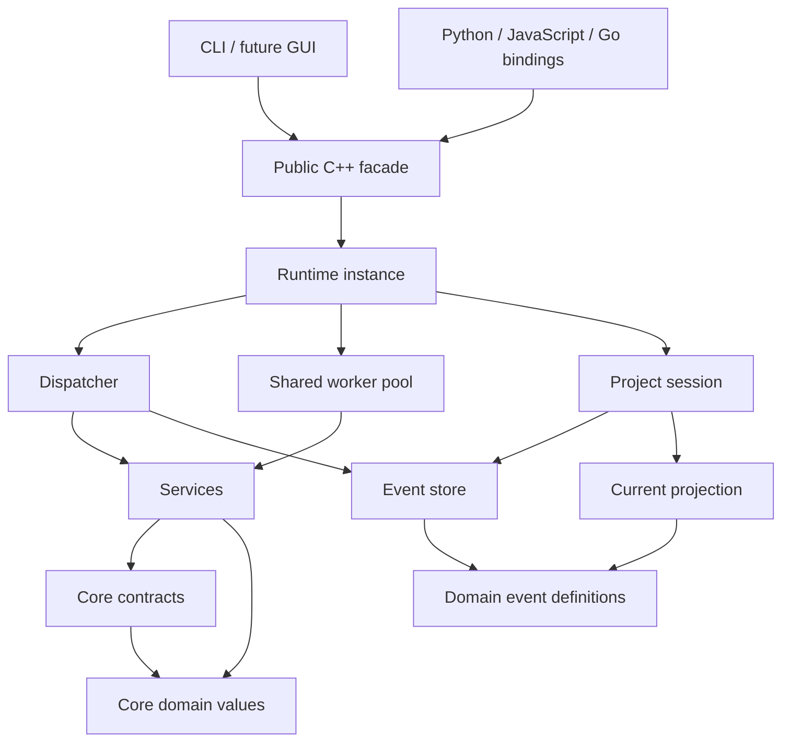

The dependency direction is downward toward stable values and contracts. Runtime composes services and persistence. The public facade is an outer adapter. The GUI and CLI do not reach into service implementation classes.

### 3.1 Layer rules

| Layer | Owns | May depend on | Must not depend on |
| --- | --- | --- | --- |
| `core/domain` | Immutable/value-semantic concepts and identifiers | Standard library | Services, runtime, storage, GUI, bindings, PE parser, native Ghidra engine |
| `core/contracts` | Service/provider/persistence interfaces, task/result contracts | `core/domain`, `core/events` | Concrete service, SQLite, event log implementation, GUI, bindings |
| `core/events` | Persistent event payload types and envelope schema | `core/domain` only | `core/contracts`, projection implementation, service implementation, GUI |
| `services/*` | PE, Sleigh, FID, decompiler, and analyzer capabilities | Core domain/contracts; private native engine | Concrete SQLite/projection storage, public bindings, GUI |
| `runtime/*` | Composition, lifecycle, workers, dispatcher, event log, event bus, projections, project | Core and service contracts plus concrete services | GUI, Python/JS/Go bindings; analyzer business algorithms |
| `bindings/cpp` | Stable native facade | Core contracts/domain and runtime public interfaces | Private native engine internals, analyzer implementation details |
| `bindings/python`, `javascript`, `go` | Language adaptation | C++ facade or generated C ABI | Runtime internals, services directly |
| `apps/*` | User interaction and process entry points | Public C++ facade | Projection storage internals, mutable service state |

MVP composition exception: existing analyzer/FID CMake targets may link concrete `ReCode::*` feature targets while the migration is in progress, as shown in the dependency graph. Those links are private composition details and must not appear in `core/contracts`, public result types, or persistence code. The final optional-service inversion remains deferred under MAJOR-005.

### 3.2 Value versus entity versus service

- A **value** is copied or shared as immutable data and is safe to serialize. Examples: `Address`, `AddressRange`, `StorageLocation`, `Instruction`, `Reference`, `FunctionSnapshot`, and `DataTypeDescriptor`.
- An **entity** has a stable identity in a project projection and changes through events. Examples: a function, instruction, symbol, memory region, and data-type record. A value snapshot represents the current entity; it is not a mutable live database object.
- A **provider** is a passive source of read-only data or an adapter to an external resource. Examples: image bytes, architecture metadata, a read-only FID database, and a project query view.
- A **service** performs an operation. Examples: loading a PE, decoding instructions, decompiling a function, matching a Function ID, or running an analyzer.
- A **runtime component** owns infrastructure and scheduling. It should not decide what a Function ID match means or how a p-code rule works.

### 3.3 Debugger service boundary

The debugger follows the same dependency direction but has an additional
thread-affinity boundary. [`core/domain/debugger.cppm`](core/domain/debugger.cppm)
contains backend-neutral process, thread, register, memory, stack, module,
breakpoint, watchpoint, exception, state, and event values. The interface in
[`core/contracts/debugger.cppm`](core/contracts/debugger.cppm) returns the
existing `Task<Result<T>>` for launch, attach, continue, pause, and stepping
operations; immediate inspection is still marshalled synchronously when a
backend requires it.

[`services/debugger/win_dbg_eng/win_dbg_eng.cppm`](services/debugger/win_dbg_eng/win_dbg_eng.cppm)
is an implementation adapter, not part of the core model. It creates and
releases DbgEng interfaces on one dedicated `std::jthread`, queues every native
call to that thread, sets execution status, and completes pending tasks only
after the same thread returns from bounded `WaitForEvent` calls. Native event
callbacks capture immutable data and enqueue generic events; they do not invoke
analysis or decompilation. The C++ facade in
[`bindings/cpp/debugger.cppm`](bindings/cpp/debugger.cppm) accepts any
`IDebugger` implementation and therefore does not depend on DbgEng. See the
backend's [`GHIDRA_PORT.md`](services/debugger/win_dbg_eng/GHIDRA_PORT.md) for
DbgEng limitations, step-out mapping, lifetime rules, and test evidence.

## 4. Canonical Core Domain

`core/domain` is the shared vocabulary, not a replacement for Ghidra's `ProgramDB`. It must not contain a class that owns every function, instruction, symbol, reference, data type, and resource. It contains small stable types that can appear in contracts, event payloads, projections, and public API results.

All primary declarations use one class/struct per `.cppm` module, following the repository's C++23 module rule. Names below are proposed final names and paths; current feature-local definitions are migration sources only. A family file such as `core/events/function_events.cppm` is an umbrella/module partition only when its public primary declaration is one tagged `FunctionEventPayload` variant; independent event payload classes with independent behavior must receive dedicated `.cppm` files. Likewise, `native/` comments in the tree summarize many future one-class modules and are not permission to place unrelated primary classes in one implementation file.

### 4.1 Identifiers and diagnostics

| File/module | Type | Required design |
| --- | --- | --- |
| `core/domain/identifiers.cppm` / `recode.core.identifiers` | `ProjectId`, `ArtifactId`, `EntityId`, `CommandId`, `EventId`, `CorrelationId`, `CausationId`, `AnalysisRunId`, `Revision` | Strong wrappers over UUID/128-bit or canonical string values. They are serializable, comparable, and never raw strings in public contracts. `Revision` is a monotonically increasing project event-log position. |
| `core/domain/diagnostics.cppm` / `recode.core.diagnostics` | `Severity`, `Diagnostic`, `DiagnosticCode`, `Error` | Value-semantic error information with stable code, English message, optional source location, and remediation hint. `std::expected<T, Error>` is the normal operation result; exceptions are reserved for programming errors and unrecoverable resource construction. |
| `core/domain/bytes.cppm` / `recode.core.bytes` | `Byte`, `Bytes`, `BytesView` | `Byte` is `std::uint8_t`; `Bytes` owns a vector; `BytesView` is a non-owning span with an explicit lifetime precondition. Bytes are serialized only where needed; p-code does not own duplicate image bytes unless the projection policy requests it. |

### 4.2 Address model

| File/module | Type | Fields and behavior |
| --- | --- | --- |
| `core/domain/address_space.cppm` / `recode.core.address_space` | `AddressSpaceKind`, `AddressSpaceId`, `AddressSpaceDescriptor` | Stable name, numeric identity, kind (`ram`, `code`, `register`, `stack`, `constant`, `unique`, `join`, `external`, `variable`, `other`), address bit width, addressable unit size, pointer size, endianness, signed-offset flag, and whether it is physical. Descriptor is immutable and serializable. |
| `core/domain/address.cppm` / `recode.core.address` | `Address` | `{AddressSpaceId space; std::uint64_t offset;}`. Strongly typed, comparable by space then offset, hashable, serializable, and immutable. Addition/subtraction operations return `expected<Address, Error>` when overflow is possible. No implicit conversion to `std::uint64_t`. A PE VA is an address in the project default RAM space. Register and constant addresses remain distinguishable. |
| `core/domain/address_range.cppm` / `recode.core.address_range` | `AddressRange`, `AddressRangeSet` | Inclusive ranges in one address space. `AddressRangeSet` stores normalized non-overlapping ranges and supports contains, intersection, union, iteration, and serialization. It is the value replacement for the relevant parts of `AddressSetView`, not a global listing. |
| `core/domain/address_factory.cppm` / `recode.core.address_factory` | `AddressFactory` | Immutable project-scoped registry of address-space descriptors and parse/format rules. It is a provider/value service boundary, not a mutable Program manager. It is used by PE mapping, Sleigh adapters, decompiler providers, and public queries. |

The address-space identity is mandatory even for x86 PE analysis. The current analyzer alias `using Address = std::uint64_t` in `analyzer_types.cppm:19` is sufficient for the current PE-only tests but cannot represent Sleigh `constant`, `register`, `unique`, stack, external, or overlay spaces faithfully. The original Java `Address`/`AddressSpace` contract and native `Address`/`AddrSpace` contract both require the distinction.

### 4.3 Storage, scalar, and p-code

| File/module | Type | Required design |
| --- | --- | --- |
| `core/domain/storage_location.cppm` / `recode.core.storage_location` | `StorageLocation` | `{AddressSpaceId space; uint64 offset; uint32 size;}`. This is the canonical value equivalent of native `VarnodeData` and Java `Varnode` storage identity. It is used by p-code, registers, stack variables, prototype storage, FID operand hashing, and decompiler provider adapters. |
| `core/domain/register.cppm` / `recode.core.register` | `RegisterDescriptor` | Name, `StorageLocation`, display name, parent register identity, and bit range. Immutable. It must not contain a pointer to a mutable native `AddrSpace`; native adapters translate it. |
| `core/domain/scalar.cppm` / `recode.core.scalar` | `Scalar` | Unsigned value, bit width, signed interpretation, and optional relocation/address classification. It preserves the distinction between an immediate constant, an address scalar, and a register value needed by FID hashing and operand APIs. |
| `core/domain/pcode_opcode.cppm` / `recode.core.pcode_opcode` | `PcodeOpcode` | A stable enum/value mapping to original `ghidra::OpCode`/`CPUI_*`. Unknown future opcode values must be representable as `UnknownPcodeOpcode` in serialized input rather than causing silent renumbering. |
| `core/domain/pcode.cppm` / `recode.core.pcode` | `PcodeOp`, `PcodeSequence` | `PcodeOp` contains opcode, optional output `StorageLocation`, ordered inputs, optional LOAD/STORE memory space, instruction sequence index, and optional source operand. `PcodeSequence` contains the owning instruction address and ordered operations. Individual p-code operations are not persistent domain events by default; they are instruction data and may be stored as one compact projection blob. |

The current `sleigh_runtime::Varnode`, `sleigh_runtime::PcodeOp`, `sleigh_runtime::PcodeOpcode`, and decompiler `Storage`, `PcodeOperation` are the main consolidation targets. A native-engine adapter may retain `ghidra::VarnodeData` internally, but no service-facing contract may expose it.

### 4.4 Instruction and flow

| File/module | Type | Required design |
| --- | --- | --- |
| `core/domain/operand.cppm` / `recode.core.operand` | `OperandKind`, `InstructionOperand`, `OperandObject` | Text, kind, optional scalar/address/register identity, exact value mask, and hash objects. This preserves the current Sleigh operand output and the original Java `Instruction.getOpObjects()` behavior needed by FID. |
| `core/domain/flow.cppm` / `recode.core.flow` | `FlowKind`, `FlowInfo`, `FlowOverride` | Target storage/address if resolvable, fall-through policy, terminal flag, and override metadata. Flow is decoded fact; an override is a separate user/analysis mutation. |
| `core/domain/instruction.cppm` / `recode.core.instruction` | `Instruction` | Address, parsed length, bytes policy/reference, mnemonic, assembly, operands, instruction mask, architecture identity, flow, p-code sequence, and source/provenance. Immutable snapshot. `InstructionKey` is an `EntityId` plus address; address alone is not sufficient for cross-project identity. |
| `core/domain/instruction_reference.cppm` / `recode.core.instruction_reference` | `InstructionReference` | Optional source operand index, exact reference class, original flow kind, fall-through, target, and source classification. This is the richer input from which a listing `Reference` projection is derived. |

The original `Instruction.java` distinguishes parsed bytes, instruction length, p-code, default flow, overrides, operand objects, and delay slots. The final `Instruction` must preserve those dimensions rather than reducing the result to mnemonic and a vector of p-code operations.

### 4.5 Functions and control flow

| File/module | Type | Required design |
| --- | --- | --- |
| `core/domain/basic_block.cppm` / `recode.core.basic_block` | `BasicBlock` | Stable block ID, address ranges, ordered instruction starts, successor/predecessor block IDs or addresses, and block kind. Immutable snapshot. Separate `BasicBlockModel` and `SimpleBlockModel` views may be represented by a model-kind field or separate query methods; do not collapse the two. |
| `core/domain/function_signature.cppm` / `recode.core.function_signature` | `FunctionParameter`, `FunctionSignature`, `CallingConvention` | Parameter name, `DataTypeId`/descriptor, storage pieces, ordinal, indirect flag, return type/storage, calling convention, varargs, no-return, and source priority. Storage must support ABI-split/join pieces, not only one string and one offset. |
| `core/domain/function.cppm` / `recode.core.function` | `FunctionKey`, `FunctionSnapshot` | Entry `Address`, stable entity ID, name and namespace, body `AddressRangeSet`, instruction starts, CFG/basic/simple blocks, thunk target, external/no-return flags, stack frame, signature, source/provenance, and analysis status. It is a read-only snapshot; mutation is through commands/events. |
| `core/domain/analysis_fact.cppm` / `recode.core.analysis_fact` | `ConstantFact`, `FunctionIdMatch`, `SwitchFact`, `StackVariable`, `AnalysisEvidence` | Facts carry source service, confidence/score, revision, and optional evidence. They can be projected normally now and later fed into a knowledge projection. They are not yet RDF triples. |

`FunctionSnapshot` intentionally has more fields than a minimal “entry plus body” value because current analyzers use CFG, block splitting, stack information, thunk relationships, no-return, signatures, and completion flags. The fields should be split into nested value modules so that a query can request a narrow projection and avoid loading all functions into memory.

### 4.6 Memory, binary identity, symbols, and data types

| File/module | Type | Required design |
| --- | --- | --- |
| `core/domain/binary.cppm` / `recode.core.binary` | `BinaryIdentity`, `BinaryArtifact`, `ResourceSetIdentity` | Canonical path/display name, format, size, SHA-256 content hash, architecture hint, primary-artifact flag, and the ordered identity of all resources used by an operation. The artifact is a project input reference, not ownership of a mutable file stream. |
| `core/domain/memory_region.cppm` / `recode.core.memory_region` | `MemoryRegion`, `MemoryPermissions` | Address range, name, read/write/execute, initialized/header/file-backed flags, source artifact range, section identity, and provenance. PE section-specific fields remain in the PE service details; this generic value is used by all loaders and providers. |
| `core/domain/symbol.cppm` / `recode.core.symbol` | `SymbolId`, `Symbol`, `SymbolSource`, `NamespaceId` | Address or external identity, name, namespace, kind, primary flag, source (`default`, `import`, `pdb`, `analysis`, `user`, `fid`), and optional source record. Symbol renaming is an event, not in-place mutation. |
| `core/domain/reference.cppm` / `recode.core.reference` | `ReferenceId`, `Reference`, `ReferenceKind` | Source and target addresses/entities, operand index, primary/source flags, flow override, stack offset, external/entry-point classification, and provenance. A stable reference ID is needed for replace/remove events. |
| `core/domain/data_type.cppm` / `recode.core.data_type` | `DataTypeId`, `DataTypeKind`, `DataTypeDescriptor`, `DataTypeField` | Name/path, kind, size/alignment, signedness, element type/count, fields, enum values, source archive, universal/source identity, and declaration. This is a serializable descriptor graph, not a mutable `DataTypeManager`. |
| `core/domain/data_object.cppm` / `recode.core.data_object` | `DataObject` | Address/range, `DataTypeId` or type descriptor, display/value metadata, read-only/alignment/string flags, and provenance. It is separate from raw PE data and instruction entities. |

The original `Program.java` aggregates memory, listing, symbol table, reference manager, bookmark manager, data types, language, compiler spec, and relocation table. The final core model deliberately represents those as independent values and projection tables. There is no `Program` class in `core/domain`; the public API can expose a `ProjectView` facade that composes read-only query providers.

### 4.7 Architecture and language

| File/module | Type | Required design |
| --- | --- | --- |
| `core/domain/architecture.cppm` / `recode.core.architecture` | `LanguageId`, `CompilerSpecId`, `ArchitectureId`, `ArchitectureDescription` | Language/compiler IDs, endianness, pointer size, spaces, registers, code/data spaces, instruction alignment, calling-convention names, and feature flags. Immutable after project readiness. |
| `core/domain/relocation.cppm` / `recode.core.relocation` | `Relocation` | Target address, width, type, addend/adjustment if known, and source loader. It is shared by PE/FID and future loaders without importing PE enums into core. |

Compiler-spec XML/SLA internals remain in service resources. The domain only carries the stable architecture facts needed by contracts and serialization.

### 4.8 Requests, variables, and structured results

The request/result values used by contracts must also have named homes. They are not anonymous structs hidden in a dispatcher implementation.

| File/module | Type | Required design |
| --- | --- | --- |
| `core/domain/processor_context.cppm` / `recode.core.processor_context` | `ProcessorContext` | Immutable named Sleigh context values plus a builder used only while preparing a decode request. It is project/architecture scoped and serializable when a decode must be reproduced. |
| `core/domain/variable.cppm` / `recode.core.variable` | `VariableDescription`, `VariableStorage` | Name, type ID, one or more storage pieces, identity, source, and isolation flag. This is the canonical replacement for decompiler provider variables and analyzer stack/parameter text. |
| `core/domain/function_id.cppm` / `recode.core.function_id` | `FunctionHashFamily`, `FunctionIdCandidate`, `FunctionIdResult`, `FunctionIdOptions` | FID query hash/evidence, scored candidates, selected names/libraries, thresholds, language/filter policy, and provenance. The hashing algorithm/database record types remain service-specific; the result is shared because analyzers, projection, and public API consume it. |
| `core/domain/decompilation.cppm` / `recode.core.decompilation` | `Decompilation`, `DecompileArtifact`, `DecompilationStatus` | Function key, read revision, C/source text, control-flow compatibility artifact, raw instructions, recovered signature/variables/switch facts, evidence, diagnostics, timeout status, and cache identity. The value is immutable and can be returned without being persisted. |

Contract-specific request values live beside their contract and use the domain values above:

- `core/contracts/pcode_decoder.cppm`: `DecodeRequest`, `DecodeBatchRequest`, `DecodeBatchResult`.
- `core/contracts/pe_loader.cppm`: `LoadOptions`, `PeLoadResult`, and its serializable `PeLoadDetails` contract DTO. Private parser structs such as the current `LoadedPeImage` do not cross the interface.
- `core/contracts/decompiler.cppm`: `DecompileRequest`, provider bundle, and output policy.
- `core/contracts/function_id.cppm`: matcher options and query scope; result types come from `core/domain/function_id.cppm`.
- `core/contracts/command.cppm`: `CommandPayload`, `MutationCommand`, `CommandResult`, and `CommandResponse`.
- `core/events/event.cppm`: `EventDraft`, committed `EventEnvelope`, `EventBatch`, event codec registration, and replay metadata.

This separation prevents a concrete dispatcher or service from becoming the accidental owner of public result types.

## 5. Core Contracts

The following contracts are the final intended boundaries. They are interfaces or value-returning abstract classes in `core/contracts`; their implementations are in services or runtime. The signatures are conceptual C++23 signatures and establish ownership/lifetime and sync/async behavior.

### 5.1 Common task and operation conventions

All service operations use:

```cpp
template<class T>
using Result = std::expected<T, core::Error>;

struct CancellationToken;                 // read-only cancellation query
struct OperationControl;                  // owned cancellation/progress/completion state
struct OperationContext {
    core::ProjectId project;
    core::Revision read_revision;
    CancellationToken cancellation;
    std::shared_ptr<OperationControl> operation;
};
```

`Task<T>` is a coroutine-returning runtime handle declared by the task contract and implemented by `runtime/workers`. `OperationControl` owns the bounded progress channel and cancellation/completion state; services never retain a caller-owned progress pointer. A task owns its result and does not borrow a project snapshot after suspension. Any `string_view`, span, or raw pointer in a service result is valid only for the duration documented by the corresponding synchronous call.

### 5.2 Providers versus services

The final distinction is strict:

- A **Provider** answers read requests or supplies immutable capabilities. It does not decide when work happens and does not append project events.
- A **Service** performs an operation, may use providers, and returns a value or mutation proposal. A mutating service goes through the runtime command/event writer; it never modifies a projection table directly.

| Contract module | Interface | Responsibility and signature |
| --- | --- | --- |
| `core/contracts/memory_provider.cppm` | `IMemoryProvider` | `virtual Result<core::Bytes> read(core::Address, size_t) const = 0;`, `virtual optional<MemoryRegion> region_at(Address) const = 0;`, `virtual vector<MemoryRegion> regions() const = 0;`. Read-only and thread-safe for a project-ready immutable image. |
| `core/contracts/architecture_provider.cppm` | `IArchitectureProvider` | Supplies immutable `ArchitectureDescription`, address factory, register lookup, language/compiler metadata, and SLA/compiler-spec resource identities. Construction/loading may be expensive; calls after readiness are read-only. |
| `core/contracts/project_query.cppm` | `IProjectQuery` | Read-only projection/provider API: `instruction_at`, `function_at`, `function_containing`, iterators/ranges for functions/instructions/data, references from/to, symbols, memory regions, signatures, data types, current revision, and `snapshot(selection)`. It must offer narrow queries and streaming iteration, not return a giant mutable model. |
| `core/contracts/pcode_decoder.cppm` | `IPCodeDecoder` | Synchronous small operation: `Result<core::Instruction> decode(core::Address, core::BytesView, const ProcessorContext&) const`. Batch operation: `Task<Result<vector<core::Instruction>>> decode_batch(DecodeBatchRequest, OperationContext)`. The service owns or leases decoder state; callers own returned values. |
| `core/contracts/pe_loader.cppm` | `IPELoader` | `Result<PeLoadResult> load(const BinaryArtifact&, LoadOptions)`. `PeLoadResult` is a contract DTO declared in this module: it contains generic `MemoryRegion`/artifact/architecture facts plus serializable PE directory details needed for ingestion. The parser's private implementation types never cross this boundary. The initial load is usually a command because it creates project events; parsing itself may be synchronous for a small file or queued for a large file. |
| `core/contracts/decompiler.cppm` | `IDecompiler` | `Task<Result<core::Decompilation>> decompile(DecompileRequest, OperationContext)`. The implementation may expose an explicit synchronous `Result<Decompilation> decompile_now(...)` for tests/CLI, but the project API treats decompilation as expensive and normally queues it. It consumes immutable providers and returns structured output plus text. |
| `core/contracts/function_id.cppm` | `IFunctionIdMatcher` | `Task<Result<FunctionIdResult>> identify(FunctionSnapshot, FunctionIdOptions, OperationContext)`. It consumes immutable FID database providers and function/instruction snapshots, returns scored matches and evidence, and never renames a function directly. |
| `core/contracts/function_id_database.cppm` | `IFunctionIdDatabase` | Passive read-only provider: metadata/language filters and `Result<vector<FunctionIdCandidate>> query(const FunctionHashFamily&) const`. A handle is shareable only if its implementation documents concurrent reads; otherwise the resource manager supplies worker-local read views. |
| `core/contracts/analyzer.cppm` | `IAnalyzer` | `AnalyzerDescriptor descriptor() const`; `Task<Result<AnalyzerResult>> analyze(const AnalysisSnapshot&, EventBatch, OperationContext)`. It reads a snapshot and returns typed mutation commands, diagnostics, and affected entities. It cannot receive a mutable `AnalysisContext`. |
| `core/contracts/command.cppm` | `ICommandHandler` | Each handler accepts a typed `CommandPayload`, validates it against an expected revision and project state, invokes services, and returns a transient `CommandResponse` plus events to append. It owns no long-lived projection pointers. |
| `core/contracts/event_store.cppm` | `IEventStore` | `Result<AppendResult> append(project, span<const EventDraft>)`, `Result<EventStream> read(project, Revision from)`, `Result<Revision> last_revision(project)`, `Result<void> flush()`, `close()`. The store assigns IDs/sequences and returns committed `EventEnvelope` values; callers cannot submit pre-committed envelopes. One writer is serialized per project. |
| `core/contracts/projection.cppm` | `IProjection` / `IProjectionStore` | `apply(CommittedEvent)`, `apply_batch(span<const CommittedEvent>)`, checkpoint/revision query, open/read/repair. Projection implementations are consumers of committed events and are replaceable. |
| `core/contracts/event_bus.cppm` | `IEventBus` | In-process subscription/publication of already-appended envelopes. It supports ordered per-project delivery, unsubscribe, and backpressure. It is not a command transport and not an RPC mechanism. |
| `core/contracts/resource_manager.cppm` | `IResourceManager` | Loads/caches immutable SLA, compiler-spec, architecture, and FID resources; returns leases/handles with explicit lifetime. It reports mandatory versus optional failures. |

The final set intentionally does not include `IFunctionProvider`, `IInstructionProvider`, `IDataProvider`, and similar interfaces if they only duplicate `IProjectQuery`. A separate provider is justified only when it supplies a different capability or lifecycle, such as external memory, immutable architecture resources, or a FID database.

Contract-local transport values have explicit ownership: `OperationContext`, `ExecutionMode`, `WorkPriority`, `CancellationToken`, `OperationControl`, and `Task<T>` are declared by `core/contracts/operation.cppm`; `DecodeRequest`/`DecodeBatchRequest` by `pcode_decoder.cppm`; `LoadOptions`/`PeLoadResult` by `pe_loader.cppm`; `DecompileRequest` and nested provider roles by `decompiler.cppm`; `AnalyzerDescriptor`/`AnalysisSnapshot`/`ImageSnapshot`/`ProjectRecords`/`AnalyzerResult` by `analyzer.cppm`; `CommandPayload`/`MutationCommand`/`CommandResult`/`CommandResponse` by `command.cppm`; and `AppendResult`/`EventStream` by `event_store.cppm`. `EventDraft`, `EventEnvelope`, `CommittedEvent`, and `EventBatch` are owned by `core/events/event.cppm` and imported by the persistence/bus contracts. No signature is allowed to rely on an implementation-only runtime type.

### 5.3 Exact command/result shape

The dispatcher uses a discriminated payload rather than a class hierarchy for every operation:

```cpp
struct CommandRequest {
    core::CommandId id;
    core::ProjectId project;
    core::CorrelationId correlation;
    std::optional<core::CausationId> causation;
    std::optional<core::Revision> expected_revision;
    ExecutionMode mode;                // inline or queued
    WorkPriority priority;
    CommandPayload payload;
};

using CommandPayload = std::variant<
    CreateProject,
    LoadPrimaryBinary,
    DecodeInstruction,
    DecodeInstructionBatch,
    DecompileFunction,
    IdentifyFunction,
    StartAnalysis,
    RenameFunction,
    AssignFunctionSignature,
    DefineData,
    CreateFunction,
    AddReference,
    SetFlowOverride,
    CloseProject>;

struct CommandResponse {
    core::CommandId command;
    CommandStatus status;               // completed, queued, cancelled, rejected, failed
    std::optional<CommandResult> result;
    std::vector<core::EventId> appended_events;
    std::optional<core::Revision> committed_revision;
    std::vector<core::Diagnostic> diagnostics;
};
```

A synchronous command returns `CommandResponse` directly. A queued command returns a `TaskHandle<CommandResponse>` or an immediately available task ID through the public facade. A decode of one instruction normally has no persistent event; a batch decode used by analysis may create one `InstructionsDecodedBatch` event if the caller explicitly requests durable materialization.

## 6. Service Boundaries

### 6.1 Shared native translation substrate

Create one private internal library, proposed as `services/translation_engine/native/`, containing the original low-level C++ port shared by Sleigh and Decompiler. It is not `core/domain`, because these classes are algorithm implementation and use pointer-owned native objects, caches, XML/marshal details, and mutable analysis state.

The shared native library owns the final single copies of:

- `address.cppm` and `space.cppm` for native `Address`/`AddrSpace`/space managers;
- `translate.cppm` for native `Translate`, `PcodeEmit`, and `AssemblyEmit` boundaries;
- `loadimage.cppm` for native `LoadImage`, `LoadImageSection`, and `LoadImageFunc`;
- `globalcontext.cppm` and `context.cppm` for Sleigh context databases/caches;
- `marshal.cppm`, `opcodes.cppm`, `error.cppm`, and raw p-code support;
- any shared parser/serialization classes needed by both engines.

Sleigh-specific implementation remains in `services/sleigh/native/`: `sleigh.cppm`, `sleighbase.cppm`, `semantics.cppm`, `slghsymbol.cppm`, `slghpattern.cppm`, `slghpatexpress.cppm`, `slaformat.cppm`, `partmap.cppm`, and related compiler/runtime classes.

Decompiler-specific implementation remains in `services/decompiler/native/`: `architecture.cppm`, `database.cppm`, `funcdata.cppm`, `funcdata_block.cppm`, `funcdata_op.cppm`, `funcdata_varnode.cppm`, `flow.cppm`, `block.cppm`, `block_switch.cppm`, `jumptable.cppm`, `fspec.cppm`, `type.cppm`, `typeop.cppm`, `varnode.cppm`, `op.cppm`, `heritage.cppm`, action/rule/transform classes, printing classes, and XML/provider adapters.

The native classes may preserve the original `ghidra` namespace for port fidelity, but that namespace is private to the engine libraries. Public service results use `recode::core` values. This prevents the public domain from depending on raw pointers such as native `AddrSpace*` or native decompiler ownership graphs.

The current project build has not yet restored the original native target composition. `services/sleigh/CMakeLists.txt` makes its internal native modules private and `SharedSleighRuntime` owns a mutable `ghidra::Sleigh`, `ghidra::ContextInternal`, `ByteLoadImage`, and decoder state protected by a mutex. `services/decompiler` ports the decompiler core but does not compile the native Sleigh implementation modules into that target; its frontend links separately against `ReCode::SleighRuntime`. The final shared translation target must therefore consolidate the common `CORE` semantics without sharing one mutable `SharedSleighRuntime` object across tasks.

The current bridge classes are explicit migration anchors: `ProviderTranslate : ghidra::Translate`, `ProviderLoadImage : ghidra::LoadImage`, `ProviderArchitecture : ghidra::Architecture`, and `SleighPcodeProvider` convert `sleigh_runtime::Decoder`/`Instruction`/`ProcessorContext` into native `ghidra::Address`, `AddrSpace`, `VarnodeData`, and `PcodeEmit`. They become the implementation of `services/decompiler/provider_adapters.cppm`. **MVP:** the immutable SLA metadata may be shared, but native decoder access is serialized by one project mutex; a native `Architecture`/`Funcdata` session remains owned by one decompiler task.

### 6.2 Sleigh service

Final public service module: `services/sleigh/sleigh_service.cppm`, module `recode.service.sleigh`.

Responsibilities:

- Load and validate one compiled `.sla` resource.
- Maintain immutable architecture metadata and a safe decoder resource.
- Translate one bounded byte window into a canonical `core::Instruction` synchronously.
- Translate a batch/range through the shared worker pool asynchronously.
- Preserve original assembly, operand objects, instruction masks, p-code, flow kind, delay-slot behavior, context values, and decode errors.
- **MVP:** use one project-scoped decoder instance protected by a mutex; do not claim parallel Sleigh decoding yet. The future worker-local decoder pool is deferred until a benchmark and a reentrant native resource split justify it.

Synchronous contract:

```cpp
Result<core::Instruction> decode(const DecodeRequest&) const;
Result<std::size_t> instruction_length(core::Address, core::BytesView) const;
```

Asynchronous contract:

```cpp
Task<Result<DecodeBatchResult>> decode_batch(const DecodeBatchRequest&, OperationContext);
```

One instruction decode is cheap when bytes and architecture state already exist. It must not append a project event unless used through a materializing command. Millions of instructions must be chunked by address ranges, bounded by cancellation and memory limits, and produce deterministic address-ordered results before commit.

Original references: `Ghidra/Features/Decompiler/src/decompile/cpp/sleigh.hh` (`Sleigh::oneInstruction`, `instructionLength`, `printAssembly`), `translate.hh` (`PcodeEmit`, `AssemblyEmit`), `loadimage.hh`, and Java `SleighInstructionPrototype.java`/`SleighDebugLogger.java` for operand objects and masks.

Current mappings: `services/sleigh/sleigh_runtime.cppm` is the public result source; `services/sleigh/sleigh_runtime_adapter.cppm` is the native callback adapter; `services/sleigh/src/address.cppm`, `space.cppm`, `translate.cppm`, `loadimage.cppm`, `globalcontext.cppm`, `marshal.cppm`, `opcodes.cppm`, `varnode.cppm`, `types.cppm`, and related files move conceptually to the shared/native engine and canonical adapter. `compression.cppm` remains in `services/sleigh/native/` because it is SLA-format-specific.

### 6.3 PE loader service

Final public service module: `services/pe_loader/pe_loader_service.cppm`, module `recode.service.pe_loader`.

The PE service retains PE-specific types in `services/pe_loader/pe_types.cppm` or equivalent. It returns:

```cpp
struct PeLoadResult {
    core::BinaryArtifact artifact;
    core::ArchitectureDescription architecture;
    std::vector<core::MemoryRegion> memory_regions;
    std::vector<core::Symbol> imported_symbols;
    std::vector<core::Symbol> exported_symbols;
    std::vector<core::Relocation> relocations;
    PeLoadDetails details;             // contract DTO declared by core/contracts/pe_loader.cppm
    ParseStatus status;
};
```

It preserves the current checked translation and error categories from `pe_loader.cppm`, including invalid signatures, truncation, invalid directories, unmapped reads, relocation widths, section permissions, imports, exports, TLS callbacks, runtime-function rows, resources, debug/CodeView records, and partial parse status. The loader does not create functions or symbols in a projection; it emits ingestion events that the projection applies and analyzers consume.

Original references: `PeLoader.java`, `PortableExecutable.java`, `NTHeader.java`, `OptionalHeader.java`, and the PE format classes under `Ghidra/Features/Base/src/main/java/ghidra/app/util/bin/format/pe/`.

Current mapping: `services/pe_loader/src/pe_loader.cppm` remains the algorithm source but its generic output types are adapted to core. `pe::LoadedPeImage` can remain an immutable service resource owned by a project, but `AnalysisContext` must not be the only owner or API route to it.

### 6.4 Function ID service

Final modules:

- `services/function_id/types.cppm`
- `services/function_id/hasher.cppm`
- `services/function_id/database.cppm`
- `services/function_id/database_resource.cppm`
- `services/function_id/function_id_service.cppm`

The parser/database layer remains autonomous and read-only once opened. A `FunctionIdDatabaseSet` is a project-scoped immutable resource cache. Opening many `.fidb` files is a resource warm-up operation; querying them is a worker-pool operation.

Recommended query flow:

1. Snapshot a function body, instruction operands, relocations, language ID, and call-tree evidence at one project revision.
2. Hash the snapshot using the existing Sleigh-derived hash rules and relocation masking.
3. Submit database queries to the shared worker pool, bounded by the database count and project FID quota.
4. Combine candidate scores deterministically: highest overall score, then stable database path/order, then stable name order.
5. Return `FunctionIdResult` with matches, scores, libraries, evidence, and whether a label threshold was met.
6. A separate command handler decides whether to emit `FunctionIdMatched`, `SymbolAdded`, `FunctionRenamed`, and `BookmarkAdded` events according to source priority and configured thresholds.

Do not use `std::async` directly in the final service. It bypasses cancellation, fairness, project lifecycle, and the shared pool. The current `FunctionIdAnalyzer::ensure_databases()` at `services/analyzers/function_id/src/function_id.cppm:196-231` is the migration source for concurrent opening, but runtime owns scheduling.

Original references: `FidAnalyzer.java`, `ApplyFidEntriesCommand.java`, `FidProgramSeeker.java`, `FidDB.java`, `FunctionsTable.java`, `MessageDigestFidHasher.java`, and `FunctionBodyFunctionExtentGenerator.java`.

### 6.5 Decompiler service

Final public module: `services/decompiler/decompiler_service.cppm`, module `recode.service.decompiler`.

The service consumes provider contracts rather than a concrete projection database:

- `IMemoryProvider` for mapped bytes and volatile ranges;
- `IPCodeDecoder` or `IInstructionProvider` for decoded p-code;
- `IProjectQuery` for functions, symbols, references, data types, and existing signatures;
- prototype, variable, comment, flow, and injection providers where needed.

The current provider types in `services/decompiler/src/decompiler.cppm:93-462` are useful and should be adapted to core contracts rather than discarded. Their responsibilities map as follows:

| Current provider | Final contract |
| --- | --- |
| `PcodeProvider` | `IPCodeDecoder`/`IInstructionProvider`, returning canonical instruction/p-code values |
| `MemoryProvider` | `IMemoryProvider` |
| `SymbolProvider` | `IProjectQuery` symbol view or a narrow immutable `ISymbolProvider` only when external symbols are supplied |
| `TypeProvider` | A `TypeProvider` role nested in `core/contracts/decompiler.cppm`, backed by a query snapshot; it is not a separate interface module unless type archives require an independently managed resource |
| `PrototypeProvider` | A `PrototypeProvider` role nested in `core/contracts/decompiler.cppm`, because prototype resolution is a decompiler input rather than a general project service |
| `CommentProvider` | A nested `CommentProvider` role or `IProjectQuery` view |
| `VariableProvider` | A nested `VariableProvider` role for source/PDB variables |
| `FlowProvider` | A nested `FlowProvider` role for manual/analysis corrections |
| injection providers | A nested `InjectionProvider` role plus service-specific call-fixup resources |

The output must become structured. These provider roles are declared together with `ProviderContext` in `core/contracts/decompiler.cppm`; they are not six new top-level interfaces. This preserves the complete existing provider surface without interface explosion.

```cpp
struct ProviderContext {
    std::shared_ptr<const IPCodeDecoder> pcode;
    std::shared_ptr<const IMemoryProvider> memory;
    std::shared_ptr<const IProjectQuery> project;
    TypeProvider types;
    PrototypeProvider prototypes;
    CommentProvider comments;
    VariableProvider variables;
    FlowProvider flow;
    InjectionProvider injections;
};
```

The output must become structured:

```cpp
struct Decompilation {
    core::FunctionKey function;
    core::Revision read_revision;
    std::string c_source;
    std::string control_flow_text;       // compatibility artifact
    std::vector<core::Instruction> raw_instructions;
    std::optional<core::FunctionSignature> recovered_signature;
    std::vector<core::VariableDescription> recovered_variables;
    std::vector<core::SwitchFact> switches;
    std::vector<core::AnalysisEvidence> evidence;
    std::vector<core::Diagnostic> diagnostics;
};
```

Textual control-flow artifacts remain available for existing switch-analysis compatibility, but future analyzers must not parse text when the native result can expose structured blocks/jump tables.

Decompilation is primarily asynchronous because the native `Architecture`, `Funcdata`, flow, heritage, type propagation, rule/action, and printing passes are expensive. One function can be decompiled synchronously in a CLI/test when the caller explicitly requests `decompile_now`, but the default public API returns `Task<Result<Decompilation>>`.

Original references: `architecture.hh`, `funcdata.hh`, `flow.hh`, `fspec.hh`, `jumptable.hh`, `type.hh`, `varnode.hh`, `pcoderaw.hh`, `translate.hh`, and the Java decompiler command/analyzer sources.

### 6.6 Analyzer services

Final location: `services/analyzers/<analyzer_name>/src/*.cppm`.

Each implementation contains Ghidra behavior, not scheduling infrastructure. `AnalysisSnapshot` is a contract value declared in `core/contracts/analyzer.cppm`; `runtime/analysis/analysis_snapshot.cppm` only builds/seals one from a project revision and must not redefine it. The analyzer receives:

```cpp
struct AnalysisSnapshot {
    core::Revision revision;
    std::shared_ptr<const core::ArchitectureDescription> architecture;
    std::shared_ptr<const IProjectQuery> query;
    std::shared_ptr<const IMemoryProvider> memory;
    std::shared_ptr<const IPCodeDecoder> decoder;
};

struct AnalyzerResult {
    core::Revision read_revision;
    std::vector<MutationCommand> commands;
    std::vector<core::Diagnostic> diagnostics;
    std::vector<core::EntityId> affected_entities;
};
```

An analyzer may do expensive read-only work on the worker pool, but all project mutations are represented by commands and committed by runtime. Examples:

- Disassembly returns `DefineInstructionBatch` and `AddReferenceBatch` commands.
- Subroutine references returns `CreateFunction` commands.
- Constant propagation returns `ConstantFactAdded` mutation commands.
- Function ID returns a match proposal; a command handler applies source/threshold policy.
- Decompiler parameter ID returns a structured signature proposal.
- User-facing analyzers return data, symbol, bookmark, or flow override commands.

The analyzer implementations retain their original Ghidra references and options. The current `AnalysisContext` helper algorithms for offcuts, flow following, body carving, CFG construction, thunk recognition, reference deduplication, and data collision checks should be moved into pure service helpers or command validators. They must not remain dependent on a global mutable context.

## Current Duplication and Consolidation Plan

The following duplication is confirmed by comparing current module names and build lists. `address`, `globalcontext`, `loadimage`, `marshal`, `opcodes`, `space`, `translate`, and `varnode` occur in both Sleigh and Decompiler source sets.

| Current location | Duplicated concept | Proposed canonical type/component | Why |
| --- | --- | --- | --- |
| `services/analyzers/shared/src/analyzer_types.cppm:19` and PE/decompiler/Sleigh APIs | Raw `Address` as `uint64_t` | `core/domain/address.cppm` | A raw integer loses address-space identity required by native and Java Ghidra contracts. |
| `services/sleigh/sleigh_runtime.cppm:38-46` | `Varnode` | `core/domain/storage_location.cppm` | Same storage triple is needed by p-code, FID, decompiler providers, registers, stack, and signatures. |
| `services/decompiler/src/decompiler.cppm:7-24` | `Storage`, `PcodeOperation` | `core/domain/storage_location.cppm`, `pcode.cppm` | The decompiler provider model and Sleigh public model otherwise require conversion through two near-identical representations. |
| `services/sleigh/sleigh_runtime.cppm:48-123` and native decompiler `opcodes`/`pcoderaw` | P-code opcode and raw operation | Canonical core p-code values plus one private native mapping | Preserve original enum values while allowing public serialization and future opcodes. |
| `services/sleigh/src/address.cppm` and `services/decompiler/src/address.cppm` | Native address implementation | `services/translation_engine/native/address.cppm` | Both are ports of original `address.hh`/`address.cc`; compiling both risks duplicate symbols and semantic drift. |
| `services/sleigh/src/space.cppm` and `services/decompiler/src/space.cppm` | Native address spaces | Shared native translation engine `space.cppm` | Sleigh and decompiler use the same original `AddrSpace` hierarchy. |
| `services/sleigh/src/translate.cppm` and `services/decompiler/src/translate.cppm` | `Translate`, p-code/assembly emit interfaces | Shared native engine `translate.cppm`, public adapter in Sleigh/decompiler services | This is explicitly the shared boundary in original `translate.hh`. |
| `services/sleigh/src/loadimage.cppm` and `services/decompiler/src/loadimage.cppm` | `LoadImage`, section/function records | Shared native engine `loadimage.cppm`, generic core memory provider adapter | Original `LoadImage` is designed for both standalone Sleigh and decompiler use. |
| `services/sleigh/src/globalcontext.cppm` and `services/decompiler/src/globalcontext.cppm` | Context database/cache | Shared native engine | Context values affect decoding and decompiler translation and must have one semantic implementation. |
| `services/sleigh/src/marshal.cppm` and `services/decompiler/src/marshal.cppm` | Native XML/marshal helper | Shared native engine | Same serialized low-level data contract. |
| `services/sleigh/src/opcodes.cppm` and `services/decompiler/src/opcodes.cppm` | Opcode names/behavior | Shared native engine mapped to core `PcodeOpcode` | Prevent mismatched opcode numbering or names. |
| `services/sleigh/src/varnode.cppm` and `services/decompiler/src/varnode.cppm` | Native varnode behavior | Shared native raw p-code engine; public values in core | Native decompiler varnodes have links/flags and cannot be the core value, but their low-level storage representation is shared. |
| `services/analyzers/shared/src/analyzer_types.cppm:99-168` and Sleigh/decompiler instruction/function models | `Instruction`, `Function`, `BasicBlock`, `Reference` | Core domain snapshots | These are cross-service concepts currently hidden in analyzer shared code. |
| `services/analyzers/shared/src/analyzer_context.cppm:437-461` | Program/listing/state aggregate | Split `ProgramProjection`, `AnalysisProjection`, `MemoryImage`, and query snapshots | A single mutable owner recreates ProgramDB and prevents concurrent read-only service work. |
| `services/analyzers/shared/src/analyzer_context.cppm:409-411` and `services/analyzers/shared/src/analyzer_types.cppm:35-62` | Transient wake-up event | `core/events` typed persistent events plus runtime scheduler trigger view | Current events have no payload/revision and are not durable; they should become a compatibility projection of real event envelopes. |
| `services/analyzers/shared/src/analyzer_registry.cppm` and `services/analyzers/shared/src/analyzer_manager.cppm` | Analyzer registration/scheduling | `runtime/analysis/AnalyzerRegistry` and `AnalysisScheduler` | These are orchestration concerns, not analyzer implementation concerns. |
| `services/function_id/src/database.cppm:137-177` and `services/analyzers/function_id/src/function_id.cppm:196-231` | FID database lifetime/loading | Runtime `ResourceManager` plus `FunctionIdService` | Resource warm-up and worker scheduling are runtime concerns; both current database/cache paths and `database.cppm:266-270`/analyzer `std::async` calls move to the shared worker/resource layer. |
| `services/decompiler/src/decompiler.cppm:93-462` and analyzer-local `Memory`/`Pcode` adapters | Provider interfaces | Core contracts with compatibility adapters | The existing provider boundary is good, but it currently has a separate decompiler type vocabulary. |
| `services/analyzers/decompiler_parameter_id/src/decompiler_parameter_id.cppm:29-125`, `decompiler_switch_analysis.cppm:32-128`, and `call_convention_id.cppm:32-210` | PE memory, Sleigh-to-p-code conversion, x86 architecture/register descriptions, body-end fallback, and decompiler invocation | One `services/decompiler/provider_adapters.cppm` factory | Repeated adapters drift and cannot provide the complete `ProviderContext`. |
| `services/analyzers/pdb_universal/src/pdb_universal.cppm:986-1036` and `pdb_msdia/src/pdb_msdia.cppm:304-333` | PDB symbol/function/name/bookmark mutation mapping | Shared `PdbMutationMapper` and typed symbol/function events | Keep MSF and DIA parsing separate, but normalize source priority and commit semantics. |
| `services/analyzers/shared/src/analyzer_context.cppm:476-492` | Normal and delay-import symbol normalization/insertion | One PE external-symbol ingestion helper | Avoid two subtly different external-symbol policies. |
| `services/function_id/src/database.cppm:137-177`, `database.cppm:266-270`, and analyzer FID cache | Path/stat cache and independent async loading | Runtime resource cache and shared worker pool | One immutable resource handle, one cancellation/fairness policy. |
| `services/analyzers/shared/test_support/analyzer_test_support.cppm:24-48`, aggregate/PDB fixture helpers, and decompiler analyzer fixtures | Fixture path and project loading | Shared test-only `ProjectFixtureResolver` | Keep test data local to each feature while removing path-convention drift. |

No implementation changes are implied by this table. It is a target-state map.

## 8. Runtime Infrastructure

### 8.1 Runtime instance

Final module: `runtime/runtime.cppm`, `recode.runtime`.

`Runtime` owns process-wide or application-wide infrastructure:

- one worker pool;
- one service registry/factory registry;
- one event codec registry;
- project manager and open-project map;
- resource cache policy;
- command handler registry;
- optional metrics/logging sink.

It does not own a project projection directly. Every project gets a `ProjectSession` with a project-scoped event writer, projection, resource handles, analysis scheduler, and caches.

### 8.2 Shared worker pool

Final modules: `runtime/workers/task.cppm`, `worker_pool.cppm`, `cancellation.cppm`, `progress.cppm`.

Use one runtime-owned CPU worker pool per `Runtime` by default. It is not one pool per service. A task is a callable/coroutine continuation with:

- task ID and project ID;
- service category (`decompile`, `fid`, `sleigh_batch`, `analysis`, `io`);
- priority;
- enqueue sequence;
- cancellation token/stop source;
- optional expected project revision;
- memory/CPU accounting hints.

Practical scheduling policy:

1. Use a bounded central priority queue protected by a mutex and condition variable, with deterministic sequence ordering.
2. Use lower numeric priority for urgent interactive work, preserving the Ghidra convention where appropriate.
3. **MVP:** do not implement per-project/category quotas or rotating fairness buckets. There is one bounded queue and one project analysis lane; quota/fairness policy is deferred until multiple simultaneous projects are a measured use case.
4. Dequeue by effective priority and enqueue sequence. No distributed scheduler is needed.
5. Use `std::stop_token`/`CancellationToken` for cooperative cancellation. The service checks at bounded loops and before expensive native calls.
6. Limit queued bytes/results for bulk Sleigh and decompiler tasks. Backpressure returns a clear `ResourceExhausted` error rather than unbounded memory growth.
7. Keep projection writes out of worker threads except through a single project commit path.

Suggested default concurrency is `max(1, hardware_concurrency - 1)`, configurable per runtime. The MVP has no reserved interactive slot; synchronous query operations remain outside the worker queue and expensive operations use ordinary priority ordering.

Native resource thread safety is explicit:

- `LoadedPeImage` and architecture descriptors are immutable and shareable.
- The current `sleigh_runtime::Decoder` owns stateful native caches and is not assumed reentrant. **MVP:** use one project-scoped decoder protected by a mutex. This is a deliberate throughput limit, not a promise of scalable parallel bulk decode.
- Native decompiler `Architecture`/`Funcdata` instances are per decompilation task. Never share a mutable native `Architecture` between concurrent decompilations.
- Parsed read-only FID database handles are treated as non-reentrant in the MVP and queried under a resource mutex. Sharing/parallel database reads require explicit thread-safety tests in a later release.

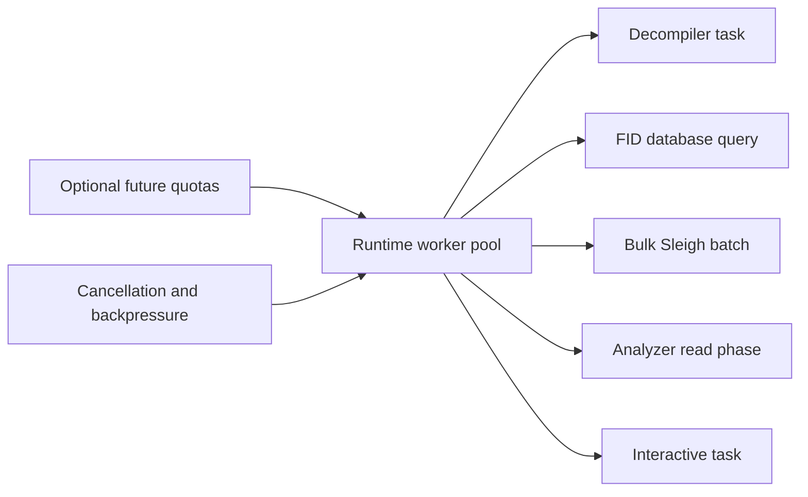

### 8.3 Dispatcher

Final modules: `runtime/dispatcher/command.cppm`, `dispatcher.cppm`, `handlers.cppm`.

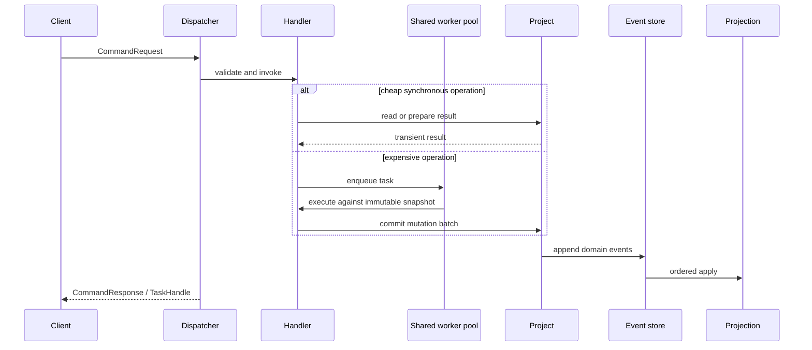

The dispatcher only routes, validates common metadata, selects sync/async execution, and converts errors. It does not contain PE parsing, p-code semantics, decompiler rules, analyzer algorithms, or projection-specific business policy.

### 8.4 Sync versus async API

| Operation | Default | Reason |
| --- | --- | --- |
| Parse an address, format an address, inspect a projection row | Synchronous | Value/query operation with bounded work. |
| Decode one instruction from an existing byte window | Synchronous | Required for interactive navigation, tests, flow stepping, and analyzer inner loops. |
| Translate a small explicitly bounded instruction list | Synchronous or caller-selected | Useful for unit tests and FID hash preparation. |
| Decode a memory range or millions of instructions | Asynchronous | CPU and memory intensive; chunked and cancellable. |
| Open/load PE metadata for a small file | Synchronous if under configured size threshold; otherwise queued | Preserve simple CLI behavior while avoiding UI stalls. |
| Open/warm SLA/compiler resources | Project initialization task | File I/O and native parsing can be expensive; mandatory resources gate readiness. |
| Query one FID database for one hash | Synchronous inside a worker | Cheap relative to broad analysis but not necessarily UI-inline. |
| Search many FID databases/functions | Asynchronous | Fan-out, hashing, cache warm-up, and result combination are expensive. |
| Decompile one function | Asynchronous by default | Native flow/heritage/type/rule/printing pipeline is expensive and can time out. |
| Decompile text already cached in projection | Synchronous query | No native computation is needed. |
| Rename, assign type, create function, set override | Synchronous command commit | Small validation plus append/apply; response includes committed revision. |
| Full automatic analysis | Asynchronous | It schedules many analyzers and may run for a long time. |

The two most important API paths are intentionally explicit:

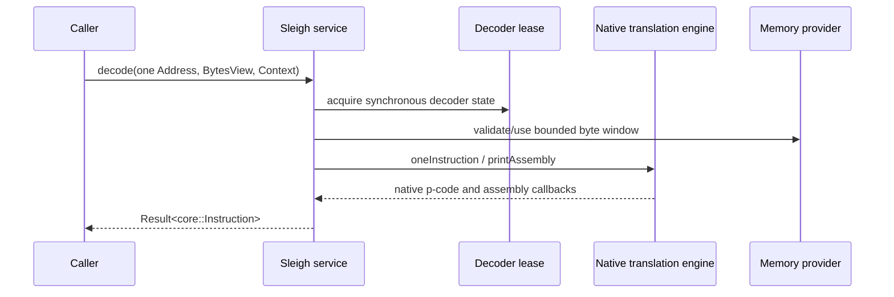

The one-instruction path is synchronous only when the caller already has a bounded byte window and can acquire the project decoder mutex. It returns a value and does not persist anything by itself. Bulk decode is queued but serialized at the decoder boundary in the MVP.

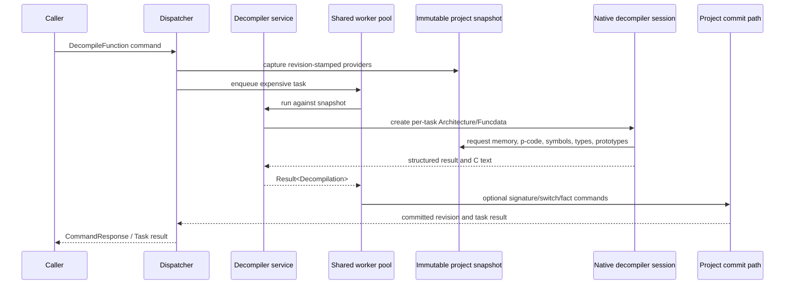

The decompiler task never holds a mutable projection pointer across suspension and never writes a projection table directly. A text-only request can return with no event; structured recovered signatures, switch facts, or user-requested artifacts use the normal command/event commit path.

### 8.5 MVP task and project lifetime

Every queued operation owns a shared `OperationState` until it reaches a terminal status:

```text
OperationState {
    task_id;
    project_id;
    project_generation;
    stop_source;
    bounded_progress_queue;
    status;                 // queued, running, committed, cancelled, failed, rejected
    result/promise;
}
```

The progress queue is owned by the operation state; `OperationContext` does not contain a raw pointer to a caller-owned progress sink. `TaskHandle` is an observer/awaiter. Dropping it requests cancellation in the MVP; the runtime still retains the operation state until the worker exits. There is no detached task API in the MVP.

`ProjectSession` owns the task registry and has a monotonically increasing `project_generation`. The close protocol is:

1. Transition `Ready` to `Closing` and increment the generation.
2. Reject new commands and request cancellation for all registered operations.
3. Allow active native calls to reach a documented cancellation boundary.
4. Enter the project commit lane and reject any proposal whose project is not `Ready` or whose generation is stale.
5. Flush the event log and projection checkpoint, release resource leases, remove task registrations, and transition to `Closed`.

A proposal that reaches the commit lane before closing may commit and is included in the close flush. A proposal that reaches it after generation/state validation fails with `ProjectClosed` and appends no events. No worker owns a raw `Project*`; it holds an operation state and a shared immutable snapshot/resource lease. Runtime shutdown closes projects first, waits for their task registries, and only then stops the shared worker pool.

## 9. Commands, Events, Event Bus, and Store

### 9.1 Semantic separation

The final implementation must preserve this distinction:

```text
Command       = request to perform an operation.
CommandResponse = transient result of that operation.
Domain Event  = significant persistent fact/change in project history.
```

One instruction's individual p-code operations are not separate domain events. A decoder response is not an event. A failed decompiler attempt is normally a diagnostic/task result, not a state event, unless the project explicitly retains a `DecompilationFailed` audit record. A materialized instruction batch, function creation, function rename, signature assignment, or reference discovery is a significant state change and is event-worthy.

### 9.2 Event definitions

Final modules are grouped by domain:

- `core/events/event.cppm`: `EventDraft`, committed `EventEnvelope`, `CommittedEvent` alias, schema/version metadata, event type key, and `EventBatch`.
- `core/events/project_events.cppm`: project/artifact/configuration lifecycle.
- `core/events/memory_events.cppm`: artifact loaded, memory region mapped/unmapped, relocation discovered.
- `core/events/code_events.cppm`: instruction batches, data objects, references, flow overrides.
- `core/events/function_events.cppm`: function created/removed/body changed/name/signature/flags.
- `core/events/symbol_events.cppm`: symbols/external symbols/renames.
- `core/events/analysis_events.cppm`: FID matches, facts, bookmarks, analyzer run status, diagnostics.
- `core/events/type_events.cppm`: data-type declarations/assignments/archive applications.

### 9.2.1 MVP event closure and mutation semantics

The MVP deliberately uses seven state events plus project/run lifecycle events rather than one event for every setter. Each state event has a typed payload and a common `StateChangeHeader`:

```text
StateChangeHeader {
    scope;                 // address range, entity set, or project scope
    producer;              // user, pe_loader, analyzer:<id>, fid, pdb, decompiler
    source_priority;
    analysis_run_id;       // absent for project/user input changes
    generation;             // producer+scope generation
    idempotency_key;
    operation;             // upsert, replace_scope, remove, invalidate
}
```

The closed MVP event set is:

| Event | Authoritative state reconstructed | Update/delete/invalidation semantics |
| --- | --- | --- |
| `ProjectCreated` | Project identity, schema, initial configuration | One immutable creation record; later configuration/resource changes use `ProjectInputsChanged`. |
| `ProjectInputsChanged` | Primary artifact and all required/optional resource identities | `upsert` replaces the manifest entry by resource kind; a removed resource is explicitly marked unavailable. Existing projections remain readable, but re-analysis is rejected until the exact required resource set is restored. |
| `MemoryStateChanged` | Memory regions, relocations, imported/exported/external image metadata | `upsert`/`remove` by stable entity ID; `replace_scope` replaces one loader-owned image scope, never user-created analysis records. |
| `ListingStateChanged` | Instructions, data objects, references, and flow overrides | Payload contains typed upserts and explicit removed IDs. `replace_scope` retires only records from the same producer and analysis generation; user flow overrides are not removed by a derived decode batch. |
| `FunctionStateChanged` | Function identity, body, CFG, name, signature, flags, stack variables, thunk/no-return state | Full function snapshot upsert is the MVP update operation. Removal is an explicit ID list. A new snapshot supersedes the previous entity revision; it does not create a second function at the same entry. |
| `SymbolStateChanged` | Internal/external symbols, aliases, namespaces, PDB/import/FID/user names | Upsert by stable symbol ID and explicit removed IDs. Source priority prevents a lower-priority derived symbol from overwriting a user/trusted symbol; rename is an upsert with `supersedes_symbol_id` where identity changes. |
| `TypeStateChanged` | Data types, archive identity, data assignments, PDB type records | Type upsert/replacement is keyed by `DataTypeId`; assignments have explicit removed/replaced IDs. Archive/type records are invalidated rather than silently deleted when a source disappears. |
| `AnalysisStateChanged` | Strings, bookmarks, constants, switches, candidate starts, address tables, embedded media, PDB evidence, and other derived facts | Upserts/removals are scoped by producer, analysis run, and entity. `replace_scope` retires the previous derived generation; `invalidate` records why a fact is no longer active. These records are current projection state, not separate event types. |
| `AnalysisRunStateChanged` | Run start, terminal status, cancellation/failure, diagnostics, and committed batch checkpoint | Only lifecycle/checkpoint records are persisted, not every progress tick. A cancelled run retains already committed state and marks uncommitted proposals discarded. |

For every state event, the projection applies operations in this order: validate project/generation, apply removals/invalidation, apply upserts, advance affected entity revisions, then checkpoint the event. `replace_scope` is the MVP supersession mechanism: it retires the prior generation in that producer/scope partition without physically deleting its event history. `invalidate` is used when provenance matters; `remove` is used for explicit user/entity deletion. Replaying the same event ID is a no-op.

The current `AnalysisContext` collections map as follows:

| Current collection/state | MVP event or status |
| --- | --- |
| `image_`, memory regions, relocations, imports/exports | `ProjectInputsChanged`, `MemoryStateChanged` |
| `instructions_`, `data_`, `references_` | `ListingStateChanged` |
| `functions_`, function signatures, stack variables, flags, body/CFG | `FunctionStateChanged` |
| `symbols_`, external entries, PDB symbols | `SymbolStateChanged` |
| `data_archives_`, PDB types, data assignments | `TypeStateChanged` |
| `constant_facts_`, potential starts/properties, bookmarks, strings, address tables, embedded media | `AnalysisStateChanged` |
| `pending_events_`, `function_creation_stack_`, `next_event_sequence_`, `total_disassembled_` | Transient scheduler/run state; never replayed as domain facts |

Batch events are required for a huge binary. A batch contains ordered records, scope/partition, producer, generation, and an idempotency key. A batch is one atomic persistent state change, not a hidden collection of independent non-durable operations.

### 9.3 Event envelope

The initial envelope should contain:

| Field | Required | Reason |
| --- | --- | --- |
| `event_id` | Yes | Stable identity for deduplication and projection diagnostics. |
| `global_sequence` | Yes | Total order within one project log and replay position. Assigned by the store. |
| `project_id` | Yes | Prevent accidental cross-project application. |
| `aggregate_kind`/`aggregate_id` | Yes | Identifies function, instruction batch, artifact, or project entity affected. |
| `aggregate_revision` | Optional in MVP; entity revision later | MVP uses the project `global_sequence`/`base_revision` as the single conflict token. Per-entity revisions are retained as payload metadata when available but are not required for commit. |
| `event_type` | Yes | Stable codec lookup key, not a C++ RTTI name. |
| `schema_version` | Yes | Payload migrations. |
| `created_at` | Yes | Audit/history; replay does not use wall-clock time for behavior. |
| `correlation_id` | Yes | Groups one command/analysis run and its events. |
| `causation_id` | Optional | Points to the triggering event or command. Useful for analyzer provenance. |
| `source_service` | Yes | `pe_loader`, `sleigh`, `function_id`, `decompiler`, `analyzer:<name>`, `user`, etc. |
| `payload_length` and checksum | Yes in binary record | Torn-write detection and safe recovery. |
| `payload` | Yes | Canonically encoded typed data sufficient to rebuild projection state. |

`timestamp` is not used for ordering; `global_sequence` is. `aggregate_revision` is not a global database transaction ID; it is an optimistic version for the affected entity. `causation_id` is not required for every generated event but should be populated for analyzer/user operations.

### 9.4 Event store format and replay

The initial physical store is:

```text
<project directory>/events.log
```

Use an append-only framed binary record with a magic value, format version, record length, envelope metadata, payload, and checksum. The payload codec is versioned and deterministic. Do not use C++ object memory layouts or pointer serialization. A human-readable diagnostic/export format can be added later; JSON is not required for the primary log because millions of instruction records would create unnecessary size and parse overhead.

Project commit protocol (coordinated by `ProjectSession`/`ProjectionCoordinator`, not implemented inside `IEventStore`):

1. Acquire the project event-writer lock.
2. Validate expected project/aggregate revisions.
3. Assign consecutive global sequence numbers.
4. Write complete framed records.
5. Flush according to durability policy (`sync`, `batched`, or `memory` for tests).
6. Apply the committed events to the current projection in order and advance its checkpoint.
7. Publish the committed envelopes to the in-process event bus only after the projection checkpoint is durable/current.
8. Return the committed revision and event IDs.

The store must recover from a truncated final frame by truncating only the incomplete tail after validating all complete prior records. A checksum failure in a complete frame is a hard diagnostic and must not be silently skipped. `EventDraft` is the pre-append value produced by a handler; `EventEnvelope`/`CommittedEvent` is the post-append value with assigned `event_id`, `global_sequence`, timestamp, and checksum metadata. This distinction prevents a caller from fabricating ordering or claiming an event was committed before the projection saw it. `IEventStore` itself never imports or calls a projection. If a process stops after the log append but before projection checkpoint, the next open replays committed events before publishing new bus notifications.

Replay:

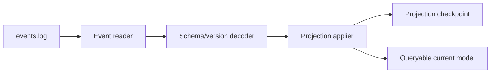

A projection rebuild starts from an empty projection, reads events in global sequence order, applies each event transactionally, and writes a checkpoint. The projection is never treated as authoritative history. Loading a valid projection directly is the normal fast open path; replay is used when the projection is absent, stale, corrupt, or intentionally rebuilt.

### 9.5 Event bus

`runtime/event_bus` receives only committed envelopes. It has:

- ordered per-project subscribers;
- bounded queues and backpressure;
- **no projection subscriber:** the project commit coordinator is the sole projection applier;
- an analysis scheduler subscriber that may coalesce trigger hints after the projection checkpoint is current;
- UI/public API subscribers that may receive a lossy/coalesced view;
- no request/response semantics.

The bus must not be used as a replacement for the dispatcher or event store. If a non-projection subscriber is offline, it resumes from its last event checkpoint rather than relying on an in-memory notification. Projection replay is initiated directly by `ProjectSession`/`ProjectionCoordinator`, never by the bus.

## 10. Projection and Storage

### 10.1 Initial projection

Final modules:

- `runtime/projections/software_model_projection.cppm`
- `runtime/projections/analysis_projection.cppm`
- `runtime/projections/diagnostics_projection.cppm`
- `runtime/projections/projection_coordinator.cppm`
- `runtime/storage/sqlite_projection_store.cppm`

Use SQLite for the initial conventional projection, with one `projection.sqlite` per project. SQLite is appropriate because:

- it provides indexed lookup by address/function/reference;
- it handles millions of rows without loading the complete model into RAM;
- WAL mode allows readers while one writer applies event batches;
- transactions make one event/batch apply atomic;
- it is available through the C++ package/build ecosystem and can be hidden behind `IProjectionStore`;
- it is simpler and more inspectable than inventing a database before projection semantics stabilize.

The event log remains the source of truth. SQLite is a cache/materialized view and may be deleted and rebuilt.

### 10.2 Projection tables/concepts

The initial schema should include the following logical tables; physical normalization can be tuned after profiling:

| Logical table | Key/indexes | Content |
| --- | --- | --- |
| `project_metadata` | project ID | Configuration, artifact identity, architecture IDs, schema versions, ready/analysis state. |
| `memory_regions` | `(space, start)`, executable range | Generic mapped regions and permissions. |
| `artifacts` | artifact ID/hash | Primary executable metadata and file references. |
| `relocations` | target address/type | Relocation evidence used by FID and analysis. |
| `external_symbols` | IAT/external identity | Imports, exports, ordinal/name, no-return and demangled data. |
| `instructions` | `(space, address)`, function containment | Length, bytes reference/blob, assembly, flow, architecture, revision. |
| `instruction_operands` | instruction ID/index | Operand text/kind/scalars/register/address and masks. |
| `instruction_pcode` | instruction ID/sequence | Compact canonical p-code blob or normalized operations, selectable by policy. |
| `data_objects` | `(space, start)` | Defined data ranges and type assignment. |
| `functions` | function ID/entry/name | Function identity, flags, namespace, body revision, signature reference. |
| `function_ranges` | range/function | Body containment and overlap queries. |
| `basic_blocks` | function/block/start | Basic/simple block views and CFG edges. |
| `references` | reference ID/source/target | Reference kind, operand, flow override, provenance and active/deleted state. |
| `symbols` | symbol ID/address/name | Symbols, source priority, primary flag and namespace. |
| `data_types` | type ID/path | Descriptor graph and source archive metadata. |
| `function_parameters` | function/ordinal | Parameters and storage pieces. |
| `analysis_facts` | fact ID/entity | Constant, FID, switch, stack, and evidence facts. |
| `bookmarks` | bookmark ID/address/category | User/analysis bookmarks. |
| `analysis_runs` | run ID | Analyzer status, revision, cancellation/failure, progress checkpoint. |
| `projection_checkpoint` | singleton | Last applied global event sequence and schema version. |

P-code can be stored normalized for query-heavy decompiler use or as a deterministic blob for compactness. The first implementation should store a canonical blob plus an optional decoded cache, because individual p-code operations are not normally queried by SQL. FID and constant propagation request decoded p-code through a service/query adapter.

### 10.3 No giant mutable ProgramDB

The projection must not expose setters such as `program.getListing().createInstruction()` that mutate shared state behind the caller's back. Public mutation methods create commands. Query handles are read-only and revision-stamped.

The projection can provide familiar views:

```text
ProjectView
  .memory()
  .listing()
  .functions()
  .symbols()
  .references()
  .data_types()
```

but each is a query facade over indexed projection data. A `FunctionView` contains a snapshot and project revision, not a pointer to an object whose fields may change asynchronously. This preserves familiar Ghidra concepts without reproducing the original tightly coupled `Program`/manager graph.

### 10.4 Projection application and concurrency

There is exactly one logical projection writer per project. Event batches are applied in global sequence order. Read connections may run concurrently in SQLite WAL mode or through immutable in-memory snapshot handles. A worker may prepare a mutation against revision `R`; commit validates `R` and either appends it or returns a conflict requiring a fresh snapshot.

Projection application must be idempotent by event ID/checkpoint. If a process crashes after event append but before projection checkpoint, replaying the event must not duplicate rows. Use unique event IDs and UPSERT/version checks.

## 11. Project System

### 11.1 Location and ownership

`Project` belongs in `runtime/project`, not `core/domain`, because it owns resources and lifecycle. Core may define `ProjectId`, `ProjectConfig`, and artifact/value descriptors, but it must not open files or construct services.

Final modules:

- `runtime/project/project.cppm`: `Project` lifecycle owner.
- `runtime/project/project_config.cppm`: serializable configuration.
- `runtime/project/project_session.cppm`: open resources, event writer, projection, scheduler, caches.
- `runtime/project/project_manager.cppm`: create/open/close and process-level map.
- `runtime/project/project_state.cppm`: `Opening`, `Loading`, `Initializing`, `Ready`, `Closing`, `Closed`, `Failed`.

### 11.2 Physical layout

```text
<project directory>/
    project.json                 # stable config, artifact identity, selected options
    events.log                   # append-only persistent domain history
    projection.sqlite            # current materialized view
    artifacts/                    # optional managed copy/reference metadata
    resources/                    # optional project-local SLA/compiler resources
    cache/
        fid/                     # optional derived FID cache/index
        decompiler/              # optional text/result cache
    diagnostics/                 # optional exported reports/logs
```

The project may reference an external primary `.exe` path, but it must record a SHA-256 content hash and size. In the MVP, the path is only a locator and is never an identity. A portable project copies the artifact/resources into content-addressed project storage; a history-only project may reference external files but cannot re-analyze when an exact resource is unavailable or mismatched.

### 11.3 Lifecycle

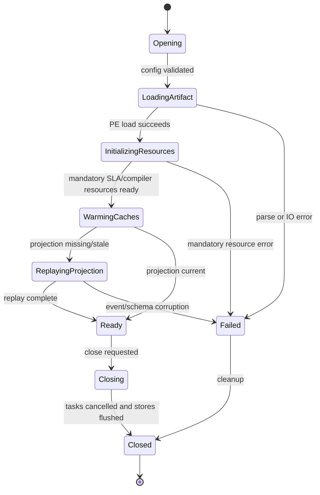

Open sequence:

1. Read and validate `project.json`.
2. Create/open the event store and validate the final log frame.
3. Load the primary artifact through `IPELoader` and verify configured hash if present.
4. Emit or verify `ProjectInputsChanged` and `MemoryStateChanged` history. Initial import is an idempotent command.
5. Open or rebuild `projection.sqlite`.
6. Resolve mandatory language/SLA/compiler-spec resources from configured paths/resource IDs.
7. Construct immutable project architecture and image providers.
8. Warm configured FID databases and optional caches. FID warm-up failure is fatal only when FID is mandatory; otherwise record a diagnostic and remain ready with that analyzer disabled.
9. Construct service instances and register analyzer descriptors.
10. Start the project-scoped analysis scheduler and transition to `Ready`.

`ProjectSession` owns service instances and resource leases. It does not expose them as mutable public objects. Close cancels queued work, waits for active tasks to reach a safe cancellation point, flushes event/projection stores, releases resource leases, and then transitions to `Closed`.

### 11.4.1 MVP resource identity and reproducibility

Every resource used to create or extend project state has this persisted identity:

```text
ResourceIdentity {
    kind;                    // primary_executable, sla, compiler_spec, fidb, pdb, gdt, ...
    logical_id;              // language/compiler/database identity where available
    sha256;
    byte_size;
    format_version;
    producer_or_parser_version;
    required;
    managed_location;        // optional project-relative content-addressed path
}
```

`ResourceSetIdentity` is a deterministic hash of the ordered resource identities plus the project analysis-contract version. `ProjectInputsChanged` records the manifest and `AnalysisRunStateChanged` records the resource-set identity used by that run. The executable, SLA, compiler specification, FID database, PDB, and data archive are checked according to `required`; a path, timestamp, or file name alone never satisfies the check.

The MVP supports two explicit modes:

- `portable`: required resources are copied under `artifacts/` or `resources/` using content-addressed names and are available for replay/re-analysis;
- `history_only`: external resources may be referenced, but projection replay is the only permitted operation when a resource is missing/mismatched. Decode, FID, decompiler, and analyzer commands fail with `ResourceUnavailable` or `ResourceMismatch` rather than silently opening a different file.

Replay of already committed events does not require the executable/SLA because event payloads contain the state needed by the projection. Any operation that computes new state must verify the exact `ResourceSetIdentity` before it starts.

### 11.5 Preloading policy

| Resource | Default policy | Failure policy |
| --- | --- | --- |
| PE artifact and mapped image | Mandatory at open | Project fails with actionable parse/IO diagnostic. |
| Architecture ID and address spaces | Mandatory | Project fails if no compatible architecture is known. |
| Primary SLA | Mandatory before `Ready` for decoding projects | Project fails; name/path and remediation are reported. |
| Compiler specification | Mandatory for full decompiler, lazy for decoder-only project | Decoder-only project may be ready; decompiler command reports unavailable resource. |
| FID databases | Warm configured/default set when FID enabled; lazy individual DBs otherwise | Record diagnostic and disable only affected DB/analyzer unless config marks FID required. |
| PDB/debug resources | Lazy or analyzer-triggered | Analyzer diagnostic; project remains usable. |
| Decompiler caches | Lazy | Cache miss recomputes; cache corruption is recoverable. |

The current analyzer-side FID cache uses path, size, and modification time. The MVP resource manager must replace that cache key with `ResourceIdentity.sha256` plus format/producer version before a database is accepted for a project; path/stat-only cache hits are not valid for re-analysis.

## 12. Analyzer Orchestration

### 12.1 Separation

The current hypothesis is correct:

- analyzer **implementation** belongs in `services/analyzers`;
- analyzer **registration, dependency validation, trigger coalescing, execution, progress, retries, and lifecycle** belong in `runtime/analysis`.

The current `AnalyzerDescriptor`, `Analyzer`, and individual analyzer classes are migration sources. `AnalyzerRegistry` and `AutoAnalysisManager` move conceptually to runtime. `AnalysisContext` splits into `AnalysisSnapshot`, projection query, service providers, and mutation command validators.

### 12.2 Descriptor

Final descriptor:

```cpp
struct AnalyzerDescriptor {
    std::string stable_id;
    std::string display_name;
    std::int32_t priority;                 // lower runs first, compatibility with Ghidra
    EventTriggerSet triggers;
    std::vector<std::string> prerequisites;
    ExecutionMode preferred_mode;          // sync inner work or queued
    AnalysisScope scope;                    // entity, range, project
    RunPolicy policy;                       // incremental, one_time, repeatable
    ExecutionClass execution_class;         // MVP: serial_mutating or read_only
    bool supports_removals;
    bool mutates_project;
};
```

The dependency graph is a DAG. Priorities retain deterministic ordering within a ready layer, but a numeric priority alone is not a dependency. The scheduler reports missing analyzers, cycles, disabled prerequisite paths, and failed prerequisite status explicitly.

### 12.3 Scheduler algorithm

```text
1. Receive a committed event batch at project revision R.
2. Convert typed events to trigger records with entity/range IDs.
3. Coalesce only equivalent trigger records; retain event IDs and earliest sequence.
4. Mark analyzers dirty according to trigger and scope.
5. Admit analyzers whose prerequisites are complete for the relevant revision.
6. Select one ready analyzer by lower priority, stable ID, then enqueue sequence.
7. Capture an owned immutable `AnalysisSnapshot` at the current projection revision.
8. Run that analyzer. Expensive read-only inner work may use the shared pool, but only one project analyzer proposal is in flight in the MVP.
9. Validate the proposal's base revision and command payloads.
10. Append and apply the complete proposal as one commit-lane transaction, or reject it without partial events.
11. Mark the analyzer checkpoint and schedule downstream triggers only after projection apply.
12. On cancellation, stop future work but retain committed events and projection state.
13. On a revision conflict, discard the proposal and recapture/retry once; a second conflict becomes a diagnostic and leaves the analyzer dirty for explicit retry.
```

The current manager coalesces by event kind and `removed` flag and often runs analyzers that scan all functions. The final trigger carries affected entity IDs and ranges so analyzers can be incremental, but each analyzer may still request a full scan when original Ghidra behavior requires it. The MVP intentionally does not run two mutating analyzers concurrently and does not commit by worker completion order. This retains the current order-sensitive behavior with a small, deterministic scheduler rather than introducing fine-grained conflict tracking.

### 12.3.1 MVP snapshot and proposal contract

`AnalysisSnapshot` means an **owned, immutable, revision-stamped DTO bundle**, not a historical SQLite view and not a live pointer into the projection:

```cpp
struct AnalysisSnapshot {
    ProjectId project;
    Revision revision;
    AnalysisScope scope;
    ResourceSetIdentity resources;
    std::shared_ptr<const ImageSnapshot> image;
    ProjectRecords records;                 // copied requested instructions/functions/etc.
};

struct AnalyzerProposal {
    std::string analyzer_id;
    AnalysisRunId run;
    Revision base_revision;
    AnalysisScope scope;
    std::vector<MutationCommand> commands;
    std::vector<Diagnostic> diagnostics;
};
```

Capture opens one read transaction on the current projection, copies the requested scope and its dependent records, then closes the transaction before expensive native work begins. The snapshot owns the copied values and holds an immutable artifact/resource lease identified by `ResourceSetIdentity`; it never holds a SQLite connection across a task suspension. The MVP provides no arbitrary historical query and no promise that an unselected entity is visible in the snapshot.

Read-your-writes is defined narrowly. A single analyzer may use a private `AnalysisWorkset` overlay initialized from the snapshot; its own proposed updates are visible to subsequent operations in that analyzer. The overlay is discarded on conflict/cancellation. A later analyzer sees those changes only after the proposal is committed, projected, and a new snapshot is captured. User commands and other project mutations enter the same project commit lane, so a proposal based on an older revision is rejected rather than merged implicitly.

The proposal precondition is intentionally coarse for the MVP: `base_revision` must equal the project revision at commit. There is no per-entity read/write conflict graph yet. Every command in one proposal is validated first and then appended/applied atomically; one invalid command rejects the whole proposal. The deterministic order is therefore: project commit-lane order, then analyzer priority, stable analyzer ID, and enqueue sequence. Fine-grained conflict sets, commutative parallel analyzers, and historical snapshot queries are deferred.

### 12.4 Analyzer pipeline

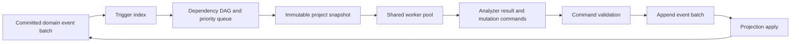

### 12.5 Current analyzer mappings

The following current analyzers remain service implementations, with runtime scheduling:

| Current analyzer family | Final service role | Original references |
| --- | --- | --- |
| Disassemble Entry Points | PE seed/disassembly service; emits instruction/reference batches | `EntryPointAnalyzer.java` |
| Function Start Search phases | Byte-pattern candidate service plus function creation commands | `FunctionStartPreFuncAnalyzer.java`, `FunctionStartAnalyzer.java`, `FunctionStartFuncAnalyzer.java`, `FunctionStartPostAnalyzer.java`, `FunctionStartDataPostAnalyzer.java` |
| Subroutine References | Call-reference function discovery | `FunctionAnalyzer.java` |
| Reference/Data/Scalar analyzers | Reference and data fact services | `OperandReferenceAnalyzer.java`, `DataOperandReferenceAnalyzer.java`, `ScalarOperandAnalyzer.java` |
| Constant Propagation | P-code symbolic fact service | `ConstantPropagationAnalyzer.java`, `SymbolicPropogator.java` |
| Function ID | FID matching/orchestration adapter | `FidAnalyzer.java`, `ApplyFidEntriesCommand.java`, `FidProgramSeeker.java` |
| Decompiler Parameter ID | Structured signature proposal service | Decompiler analysis/command sources and current `decompiler_parameter_id.cppm` |
| Decompiler Switch Analysis | Native switch/jump-table fact service | `DecompilerSwitchAnalyzer.java`, `DecompilerSwitchAnalysisCmd.java` |
| Stack/Call Convention/Variadic | Function signature/frame services | `StackVariableAnalyzer.java`, decompiler call-convention sources, variadic analyzer sources |
| PDB analyzers | External symbol/type import services | PDB analyzer/parser sources |
| Strings/embedded media/filler/address tables | Memory data discovery services | Current source comments and matching Base analyzers |
| Demangler/Windows resource/parameter propagation | Symbol/external/data enrichment services | Current source comments and `GHIDRA_PORT.md` files |

Each analyzer's current comments and local `GHIDRA_PORT.md` remain the source of detailed behavioral parity. The architecture only changes how the result is committed and scheduled.

## 13. End-to-End GTA5.exe Workflow

The following is the required target behavior for one primary executable project.

### 13.1 Open and load

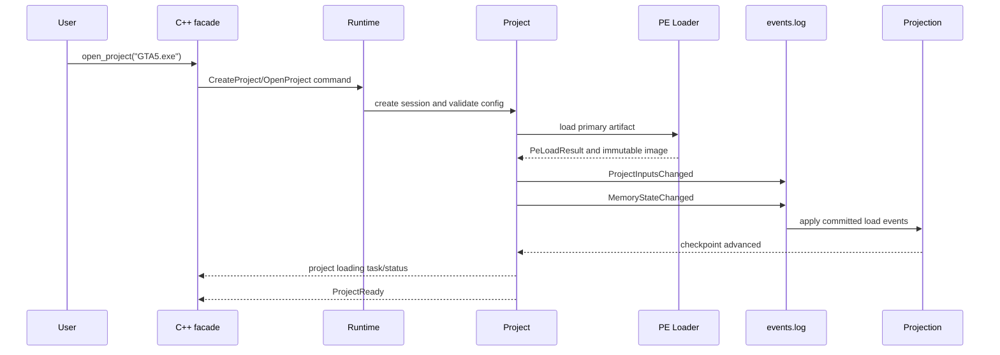

The PE parser emits all metadata needed for later analysis as immutable load facts. It does not create a function for every export or infer code from every executable section.

### 13.2 Resource initialization

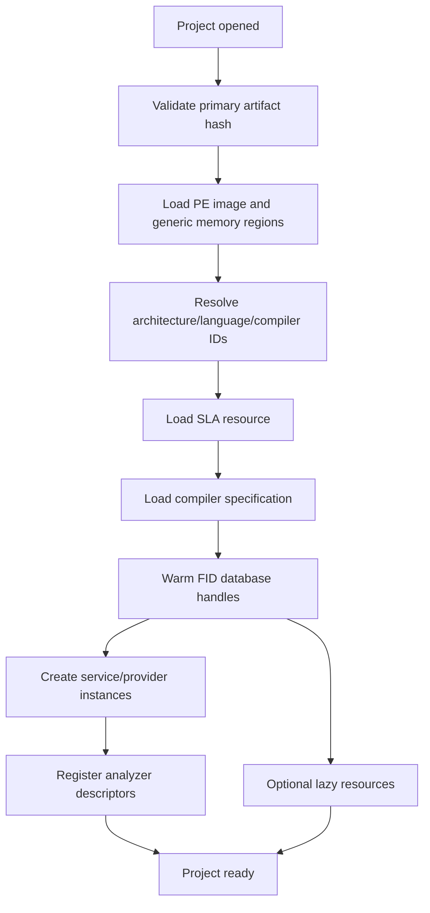

### 13.3 Automatic analysis

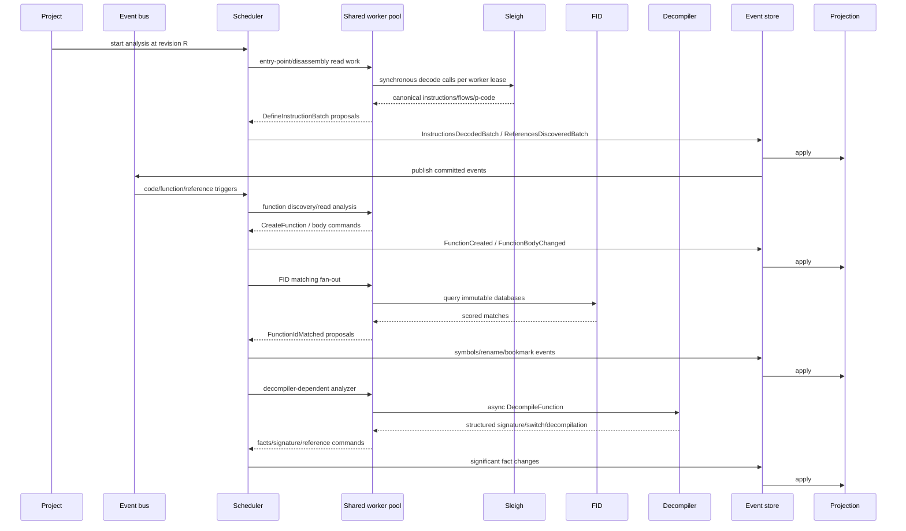

The diagram shows service work that may be queued independently, not concurrent project mutation. In the MVP, the scheduler admits one mutating analyzer at a time; FID/decompiler/Sleigh worker results become a single proposal and return through the project commit lane before the next order-sensitive analyzer is admitted.

### 13.4 User commands

The same mutation path handles user changes:

1. User browses functions through `ProjectView`/`IProjectQuery` at a revision.
2. User renames a function. `RenameFunction` validates the name and source priority, appends `FunctionRenamed`, applies the projection, and returns the new revision.
3. User assigns a data type. `AssignDataType` validates the descriptor ID and assignment range, appends `DataTypeAssigned`, and updates the projection.
4. User creates a function in an unexplored executable range. `CreateFunction` validates mapping/offcut/overlap, optionally calls synchronous Sleigh flow decoding for the seed, and appends instruction/function/reference events. Large flow discovery uses a queued task.
5. Downstream analyzers receive committed events and decide whether to run incrementally.

### 13.5 Close/reopen/replay

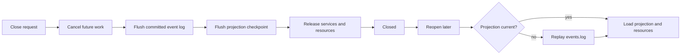

Projection reconstruction must produce the same current model fingerprint for deterministic event history. Replay must not invoke analyzers or regenerate events; it only applies stored events. An explicit “reanalyze” command is separate and creates a new analysis run/correlation ID.

## 14. Public C++ API and Bindings

### 14.1 Layering

The stable native facade is `bindings/cpp`, but the runtime and services do not depend on it. The direction is:

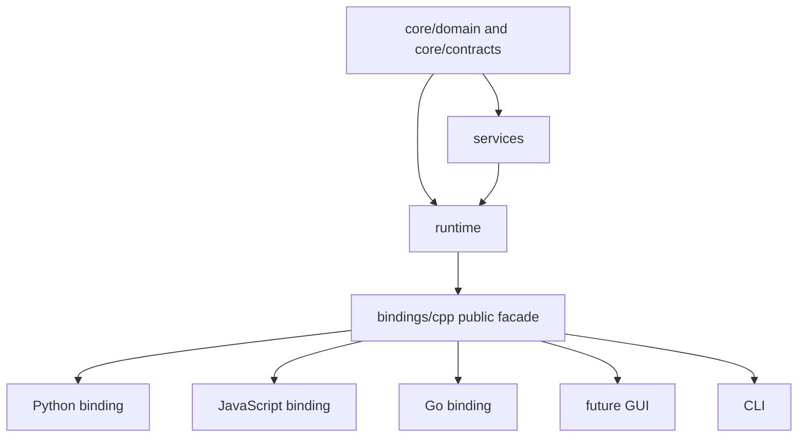

`runtime -> bindings/cpp -> runtime` is forbidden. `bindings/cpp` imports runtime's public interfaces and constructs a runtime; runtime never imports the facade.

### 14.2 C++ facade modules

Final modules:

- `bindings/cpp/runtime.cppm`: application/runtime creation and shutdown.
- `bindings/cpp/project.cppm`: project handle and lifecycle/status.
- `bindings/cpp/commands.cppm`: typed command client and task handles.
- `bindings/cpp/queries.cppm`: revision-stamped read-only ProjectView/listing/function/symbol/reference queries.
- `bindings/cpp/results.cppm`: stable result/error/value exports.

Example facade shape:

```cpp
class Runtime {
public:
    static Result<std::shared_ptr<Runtime>> create(RuntimeConfig);
    Task<Result<Project>> open_project(ProjectConfig);
};

class Project {
public:
    ProjectId id() const;
    ProjectState state() const;
    ProjectView view() const;
    Task<Result<CommandResponse>> submit(CommandRequest);
    Result<CommandResponse> submit_now(CommandRequest);
    Task<Result<Decompilation>> decompile(FunctionKey);
};
```

The public facade uses stable core values and opaque handles. It does not expose `sqlite3*`, native `ghidra::Architecture*`, `Sleigh*`, `Funcdata*`, `std::future` implementation details, or projection table handles.

### 14.3 Language bindings

- **Python:** pybind11 or a generated CPython extension over the C++ facade. Expose immutable dataclasses/value objects, awaitable task handles, cancellation, and iterator pagination. Do not expose native engine pointers.
- **JavaScript:** Node-API for desktop/CLI use or a separately selected WebAssembly adapter later. Promise-returning tasks map to C++ task handles; events map to subscription callbacks with explicit unsubscribe.
- **Go:** a narrow C ABI generated from the C++ facade or a C shim over opaque handles, consumed via cgo. C ABI functions return owned buffers/handles with explicit release functions and stable error codes. Do not make cgo call C++ templates directly.

Bindings are future work and must not influence core domain design with language-specific ownership. Every facade value must be serializable or copyable across a language boundary.

## 15. Dependency Graph and Forbidden Dependencies

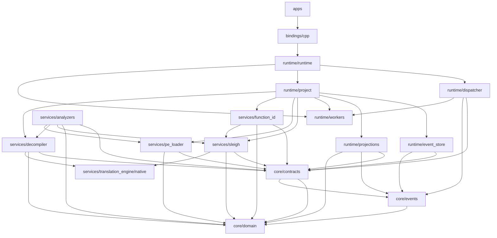

Arrows show compile-time dependency direction: each component points to the stable component it imports. `core/events` depends only on domain; contracts depend on events and domain, never the reverse. Runtime composes services and persistence through those contracts. The public facade is an outer adapter. The GUI and CLI do not reach into service implementation classes.

Forbidden dependencies:

- `core/domain` must not import `pe_loader`, `sleigh_runtime`, `decompiler`, SQLite, filesystem project state, or GUI.
- `core/contracts` must not name concrete native Ghidra classes or concrete database tables.
- `core/events` must depend only on `core/domain`; it must not import `core/contracts`, runtime, or service implementations. `core/contracts` may import event definitions to type persistence/bus interfaces.
- `core/events` must not call services while decoding/applying events.
- `services` must not write SQLite or `events.log` directly.
- `services/analyzers` must not depend on `runtime/dispatcher` concrete classes; it uses analyzer contracts and command values.
- `runtime/projections` must not call analyzers or regenerate missing events.
- `runtime/workers` must not know business semantics of PE/FID/decompiler work.
- `bindings/cpp` must not be imported by runtime or services.
- `apps/gui` and `apps/cli` must not access projection storage or native engine modules directly.

## 16. Proposed Final Folder Tree

This is the target tree. It is intentionally more structured than the current feature tree. A migration may retain compatibility CMake targets temporarily, but there must be one canonical implementation location for each component.

```text

├── CMakeLists.txt
├── README.md
├── core/
│   ├── README.md
│   ├── tests/
│   │   ├── domain_tests.cppm
│   │   ├── event_codec_tests.cppm
│   │   └── contract_value_tests.cppm
│   ├── domain/
│   │   ├── README.md
│   │   ├── identifiers.cppm
│   │   ├── diagnostics.cppm
│   │   ├── bytes.cppm
│   │   ├── address_space.cppm
│   │   ├── address.cppm
│   │   ├── address_range.cppm
│   │   ├── address_factory.cppm
│   │   ├── binary.cppm
│   │   ├── memory_region.cppm
│   │   ├── relocation.cppm
│   │   ├── storage_location.cppm
│   │   ├── register.cppm
│   │   ├── scalar.cppm
│   │   ├── pcode_opcode.cppm
│   │   ├── pcode.cppm
│   │   ├── operand.cppm
│   │   ├── flow.cppm
│   │   ├── instruction.cppm
│   │   ├── reference.cppm
│   │   ├── instruction_reference.cppm
│   │   ├── basic_block.cppm
│   │   ├── function_signature.cppm
│   │   ├── function.cppm
│   │   ├── symbol.cppm
│   │   ├── data_type.cppm
│   │   ├── data_object.cppm
│   │   ├── analysis_fact.cppm
│   │   ├── processor_context.cppm
│   │   ├── variable.cppm
│   │   ├── function_id.cppm
│   │   ├── decompilation.cppm
│   │   └── architecture.cppm
│   ├── contracts/
│   │   ├── README.md
│   │   ├── operation.cppm
│   │   ├── memory_provider.cppm
│   │   ├── architecture_provider.cppm
│   │   ├── project_query.cppm
│   │   ├── pcode_decoder.cppm
│   │   ├── pe_loader.cppm
│   │   ├── function_id.cppm
│   │   ├── function_id_database.cppm
│   │   ├── decompiler.cppm
│   │   ├── analyzer.cppm
│   │   ├── command.cppm
│   │   ├── event_store.cppm
│   │   ├── projection.cppm
│   │   ├── event_bus.cppm
│   │   └── resource_manager.cppm
│   └── events/
│       ├── README.md
│       ├── event.cppm
│       ├── project_events.cppm
│       ├── memory_events.cppm
│       ├── code_events.cppm
│       ├── function_events.cppm
│       ├── symbol_events.cppm
│       ├── type_events.cppm
│       └── analysis_events.cppm
├── services/
│   ├── README.md
│   ├── translation_engine/
│   │   ├── README.md
│   │   ├── GHIDRA_PORT.md
│   │   ├── native/
│   │       ├── address.cppm
│   │       ├── space.cppm
│   │       ├── types.cppm
│   │       ├── translate.cppm
│   │       ├── loadimage.cppm
│   │       ├── globalcontext.cppm
│   │       ├── context.cppm
│   │       ├── marshal.cppm
│   │       ├── opcodes.cppm
│   │       ├── pcoderaw.cppm
│   │       └── error.cppm
│   │   └── tests/
│   │       ├── native_translation_tests.cppm
│   │       └── cross_service_translation_tests.cppm
│   ├── pe_loader/
│   │   ├── README.md
│   │   ├── GHIDRA_PORT.md
│   │   ├── pe_types.cppm
│   │   ├── pe_parser.cppm
│   │   ├── pe_loader_service.cppm
│   │   └── tests/
│   ├── sleigh/
│   │   ├── README.md
│   │   ├── GHIDRA_PORT.md
│   │   ├── native/
│   │   │   ├── sleigh.cppm
│   │   │   ├── sleighbase.cppm
│   │   │   ├── semantics.cppm
│   │   │   ├── slghsymbol.cppm
│   │   │   ├── slghpattern.cppm
│   │   │   ├── slghpatexpress.cppm
│   │   │   ├── slaformat.cppm
│   │   │   ├── compression.cppm
│   │   │   └── partmap.cppm
│   │   ├── sleigh_service.cppm
│   │   ├── decoder_resource.cppm
│   │   └── tests/
│   ├── function_id/
│   │   ├── README.md
│   │   ├── GHIDRA_PORT.md
│   │   ├── types.cppm
│   │   ├── storage_helpers.cppm
│   │   ├── parse_exception.cppm
│   │   ├── buffer_file.cppm
│   │   ├── hasher.cppm
│   │   ├── database.cppm
│   │   ├── database_resource.cppm
│   │   ├── function_id_service.cppm
│   │   └── tests/
│   ├── decompiler/
│   │   ├── README.md
│   │   ├── GHIDRA_PORT.md
│   │   ├── native/              # architecture/database/funcdata/flow/type/rule/print modules
│   │   ├── provider_adapters.cppm
│   │   ├── decompiler_types.cppm
│   │   ├── decompiler_service.cppm
│   │   ├── decompilation_result.cppm
│   │   └── tests/
│   └── analyzers/
│       ├── README.md
│       ├── GHIDRA_PORT.md
│       ├── common/
│       │   ├── analyzer_helpers.cppm
│       │   └── analyzer_options.cppm
│       ├── disassemble_entry_points/
│       ├── function_start_search/
│       ├── subroutine_references/
│       ├── reference/
│       ├── data_reference/
│       ├── scalar_operand_references/
│       ├── constant_propagation/
│       ├── function_id/
│       ├── decompiler_parameter_id/
│       ├── decompiler_switch_analysis/
│       ├── stack/
│       ├── call_convention_id/
│       ├── variadic_function_signature_override/
│       ├── pdb_universal/
│       ├── pdb_msdia/
│       ├── ascii_strings/
│       ├── embedded_media/
│       ├── create_address_tables/
│       ├── condense_filler_bytes/
│       ├── demangler_microsoft/
│       ├── windows_resource_reference/
│       ├── windows_pe_x86_propagate_external_parameters/
│       ├── x86_constant_reference/
│       ├── non_returning_functions/
│       ├── shared_return_calls/
│       ├── call_fixup_installer/
│       ├── external_entry_references/
│       ├── apply_data_archives/
│       ├── aggressive_instruction_finder/
│       └── tests/
├── runtime/
│   ├── README.md
│   ├── runtime.cppm
│   ├── tests/
│   │   ├── worker_pool_tests.cppm
│   │   ├── event_store_tests.cppm
│   │   ├── projection_replay_tests.cppm
│   │   └── project_lifecycle_tests.cppm
│   ├── workers/
│   │   ├── README.md
│   │   ├── task.cppm
│   │   ├── cancellation.cppm
│   │   ├── progress.cppm
│   │   └── worker_pool.cppm
│   ├── dispatcher/
│   │   ├── README.md
│   │   ├── command.cppm
│   │   ├── dispatcher.cppm
│   │   └── handlers.cppm
│   ├── event_bus/
│   │   ├── README.md
│   │   └── event_bus.cppm
│   ├── event_store/
│   │   ├── README.md
│   │   ├── append_only_log.cppm
│   │   ├── event_codec.cppm
│   │   └── replay.cppm
│   ├── storage/
│   │   ├── README.md
│   │   ├── sqlite_connection.cppm
│   │   └── sqlite_projection_store.cppm
│   ├── projections/
│   │   ├── README.md
│   │   ├── software_model_projection.cppm
│   │   ├── analysis_projection.cppm
│   │   ├── diagnostics_projection.cppm
│   │   └── projection_coordinator.cppm
│   ├── analysis/
│   │   ├── README.md
│   │   ├── analyzer_registry.cppm
│   │   ├── analysis_snapshot.cppm
│   │   ├── analysis_scheduler.cppm
│   │   ├── trigger_index.cppm
│   │   └── analysis_run.cppm
│   ├── resources/
│   │   ├── README.md
│   │   ├── resource_manager.cppm
│   │   ├── sla_cache.cppm
│   │   ├── compiler_spec_cache.cppm
│   │   └── fid_cache.cppm
│   └── project/
│       ├── README.md
│       ├── project.cppm
│       ├── project_config.cppm
│       ├── project_state.cppm
│       ├── project_session.cppm
│       └── project_manager.cppm
├── bindings/
│   ├── README.md
│   ├── cpp/
│   │   ├── README.md
│   │   ├── runtime.cppm
│   │   ├── project.cppm
│   │   ├── commands.cppm
│   │   ├── queries.cppm
│   │   └── results.cppm
│   ├── python/
│   │   ├── README.md
│   │   └── module.cpp
│   ├── javascript/
│   │   ├── README.md
│   │   └── module.cpp
│   └── go/
│       ├── README.md
│       ├── c_api.cpp
│       └── include/
├── apps/
│   ├── README.md
│   ├── cli/
│   │   ├── README.md
│   │   └── main.cppm
│   └── gui/
│       ├── README.md
│       └── main.cppm
└── tests/
    ├── integration/
    ├── replay/
    └── fixtures/
```

Every new C++ module directory requires its own English `README.md`; every ported Ghidra feature directory requires `GHIDRA_PORT.md` with exact original/current/final references. The tree above is a target, not a request to create those files as part of this architecture-only task.

### 16.1 Build, test, and port-evidence boundaries

The final targets should be arranged so each boundary can be validated independently:

| Target/module | Focused validation | Required evidence |
| --- | --- | --- |
| `ReCode::Core` | Domain serialization, address-space arithmetic, p-code round trips, event payload codecs | `core/README.md` and source comments reference Java/native origins; core has no service/runtime link. |
| `ReCode::TranslationEngine` | Native marshal/scalar/type/address/space/translate compatibility and cross-link tests | `services/translation_engine/README.md`, `GHIDRA_PORT.md`, and tests proving Sleigh and Decompiler use the same target. |
| `ReCode::Sleigh` | SLA loading, decompression, one-instruction decode, batch cancellation, context/operand/p-code parity | `services/sleigh/README.md`, `GHIDRA_PORT.md`, focused GoogleTest target. |
| `ReCode::PeLoader` | Existing malformed/PE32/PE32+/directory/address/partial parsing suite | `services/pe_loader/README.md`, `GHIDRA_PORT.md`, focused GoogleTest target. |
| `ReCode::FunctionId` | `.fidb` parsing, full/specific hash, relation family, score/filter/application policy | `services/function_id/README.md`, `GHIDRA_PORT.md`, focused GoogleTest target and original-oracle fixtures. |
| `ReCode::Decompiler` | Provider contracts, native engine tests, structured result and per-task isolation | `services/decompiler/README.md`, `GHIDRA_PORT.md`, focused native/provider GoogleTest targets. |
| `ReCode::Runtime` | Worker fairness/cancellation, event append/recovery, projection apply/replay, project lifecycle | `runtime/README.md` and module READMEs; CTest integration/replay targets. |
| analyzer services | One focused test target per analyzer plus aggregate 34-analyzer stability test | Analyzer `README.md`/`GHIDRA_PORT.md`, original-source links, fixture manifest, and CTest registration. |

Use the repository wrappers rather than ad hoc commands: `build.bat <feature>` for focused build/tests, `build.bat all` for final integration, and the prescribed format/tidy wrappers for C++ modules. Adding SQLite changes the target graph, so the first SQLite-enabled configure uses the feature/runtime clean configure mode; subsequent edits use the preserved build. The architecture document does not change `vcpkg.json`, CMake, or build scripts.

## 17. Class and Module Catalog

The catalog below is the implementation blueprint for the most important final components. “Persistence” means whether the component's output is event/projection state, not whether the implementation object itself is serialized.

| Name | Location | Responsibility / public API | Dependencies / thread safety / sync-async | Persistence | Original Ghidra source | Current ReCode / migration |
| --- | --- | --- | --- | --- | --- | --- |
| `Address` | `core/domain/address.cppm` | Strong address-space-aware value; parse/format/arithmetic | Domain only; immutable, thread-safe; sync | Event payload/projection key | Java `Address.java`; native `address.hh` | `services/analyzers/shared/src/analyzer_types.cppm` raw alias; `services/sleigh/src/address.cppm` and `services/decompiler/src/address.cppm` |
| `AddressRangeSet` | `core/domain/address_range.cppm` | Normalized inclusive address intervals | Domain only; immutable value or local builder | Function/memory/data projection | `AddressSet.java`, `AddressSetView.java` | `AddressRange` and function body sets in analyzer types |
| `StorageLocation` | `core/domain/storage_location.cppm` | Varnode/storage triple | Domain only; immutable | P-code/signature blobs | `pcoderaw.hh` `VarnodeData`; Java `Varnode.java` | `services/sleigh/sleigh_runtime.cppm` `Varnode`, `services/decompiler/src/decompiler.cppm` `Storage` |
| `PcodeOp` | `core/domain/pcode.cppm` | Canonical operation with output/input storage | Domain only; immutable | Instruction p-code blob | `PcodeOpRaw`, `PcodeOp`, `translate.hh` | `services/sleigh/sleigh_runtime.cppm` `PcodeOp`, `services/decompiler/src/decompiler.cppm` `PcodeOperation` |
| `Instruction` | `core/domain/instruction.cppm` | Complete decoded instruction snapshot | Domain plus p-code/flow/operand; immutable | `instructions` projection, optional batch event | `Instruction.java`, Sleigh instruction prototype classes | `services/sleigh/sleigh_runtime.cppm` `Instruction`, `services/decompiler/src/decompiler.cppm` `Instruction` |
| `MemoryRegion` | `core/domain/memory_region.cppm` | Generic mapped memory permissions/range | Domain only; immutable | `MemoryStateChanged` and table | Java `MemoryBlock`/`Memory`; native `LoadImageSection` | `services/pe_loader/src/pe_loader.cppm` `MemoryRegion` |
| `FunctionSnapshot` | `core/domain/function.cppm` | Function body/CFG/name/signature view | Domain values; immutable | Function/body/signature events and tables | Java `Function.java`, `FunctionManager.java` | `services/analyzers/shared/src/analyzer_types.cppm` `Function` |
| `Reference` | `core/domain/reference.cppm` | Stable source-target relation and provenance | Domain values; immutable | Reference events/table | Java `Reference.java`, `ReferenceManager.java` | `services/analyzers/shared/src/analyzer_types.cppm` `Reference` |
| `InstructionReference` | `core/domain/instruction_reference.cppm` | Operand/flow-specific reference fact used to derive references | Domain values; immutable | Included in reference batch events or instruction projection | Java `Instruction.getReferencesFrom()`/`ReferenceManager`; native flow emitters | Sleigh `FlowInfo`, analyzer reference creation helpers |
| `DataTypeDescriptor` | `core/domain/data_type.cppm` | Serializable type graph node | Domain; immutable descriptor | Type events/table | Java `DataType.java`, `DataTypeManager.java` | `services/decompiler/src/decompiler.cppm` `TypeDescription`; `services/analyzers/shared/src/analyzer_types.cppm` PDB type records |
| `ArchitectureDescription` | `core/domain/architecture.cppm` | Stable language/compiler/spaces/registers | Domain; immutable after ready | Project metadata/resource manifest | Java `Language`, `CompilerSpec`; native `Architecture` subset | `services/decompiler/src/decompiler.cppm` `ArchitectureDescription`, analyzer PE machine mapping |
| `ProcessorContext` | `core/domain/processor_context.cppm` | Named Sleigh context values for reproducible decoding | Domain; immutable request value; sync use | Optional decode request metadata | Native `ContextDatabase`/`ParserContext`; Java processor context classes | `services/sleigh/sleigh_runtime.cppm` `ProcessorContext` |
| `VariableDescription` | `core/domain/variable.cppm` | Source/local/parameter variable and ABI storage pieces | Domain; immutable | Variable/signature/fact projection | Java `Variable`, `Parameter`, `VariableStorage`; native decompiler variable classes | `services/decompiler/src/decompiler.cppm` `VariableDescription`; `services/analyzers/shared/src/analyzer_types.cppm` `FunctionParameter`/`StackVariable` |
| `FunctionIdResult` | `core/domain/function_id.cppm` | Scored FID candidates and match evidence | Domain result; immutable; async-producing service | Optional `FunctionIdMatched` event, not every query | `FidProgramSeeker`, `HashMatch`, `FidSearchResult` | `services/function_id/src/types.cppm` `IdentificationResult`, `services/analyzers/function_id/src/function_id.cppm` |
| `Decompilation` | `core/domain/decompilation.cppm` | Structured/text decompiler result and diagnostics | Domain result; immutable; async-producing service | Text/cache optional; facts/signatures evented | Native decompiler output and Java decompiler commands | `services/decompiler/src/decompiler.cppm` `recode::decompiler::DecompilationResult` |
| `IProjectQuery` | `core/contracts/project_query.cppm` | Revision-stamped read view | Implemented by projection; read-safe; sync paginated queries | No direct state; reads projection | Java `Program`, `Listing`, managers | `services/analyzers/shared/src/analyzer_context.cppm` getters |
| `IPCodeDecoder` | `core/contracts/pcode_decoder.cppm` | One/batch canonical decoding | Service implementation; one decode sync, batch async; decoder lease | Optional materialized instruction events | Native `Translate`, `Sleigh` | `services/sleigh/sleigh_runtime.cppm` `Decoder` |
| `IPELoader` | `core/contracts/pe_loader.cppm` | Validate/parse PE artifact | PE service; load may be async; immutable result | Load/memory/relocation events | `PeLoader.java`, PE format classes | `services/pe_loader/src/pe_loader.cppm` `PeLoader` |
| `PeLoadResult` | `core/contracts/pe_loader.cppm` | Contract DTO carrying generic image facts and required PE directory details | Immutable result; produced sync/async by PE service | Load event payload source | `PortableExecutable.java`, PE directory classes | `services/pe_loader/src/pe_loader.cppm` `LoadedPeImage` adapter |
| `IFunctionIdMatcher` | `core/contracts/function_id.cppm` | Hash/query/combine FID candidates | FID service; async worker pool | Match/name/bookmark events only when applied | `FidAnalyzer`, `ApplyFidEntriesCommand`, `FidProgramSeeker` | `services/analyzers/function_id/src/function_id.cppm` plus `services/function_id/src/*.cppm` |
| `IDecompiler` | `core/contracts/decompiler.cppm` | Structured C/p-code analysis | Decompiler service; async default, optional sync | Decomp cache optional; signature/switch facts evented | Native architecture/decompiler and Java commands | `services/decompiler/src/decompiler.cppm` facade / `decompiler_impl.cppm` |
| `IAnalyzer` | `core/contracts/analyzer.cppm` | Read snapshot, return mutation proposals | Analyzer service; pool execution; no mutable context | Run status and emitted domain events | `AbstractAnalyzer`, analyzer classes | `services/analyzers/shared/src/analyzer_base.cppm` |
| `AnalysisSnapshot` | `core/contracts/analyzer.cppm` | Immutable revision-stamped bundle of query/memory/architecture/decoder providers | Contract value; safe to share with worker tasks; built by runtime | No direct persistence; revision is recorded in analysis-run events | `Program`/provider state passed to `Analyzer.added` | `services/analyzers/shared/src/analyzer_context.cppm` plus local decompiler adapters |
| `CommandDispatcher` | `runtime/dispatcher/dispatcher.cppm` | Route/execute typed commands | Runtime services/project; sync or task-returning | No; responses transient | Ghidra commands plus runtime orchestration | No current equivalent |
| `WorkerPool` | `runtime/workers/worker_pool.cppm` | Shared bounded CPU scheduling | Runtime; thread-safe; async | No | `AutoAnalysisManager` shared analysis pool concept | Current FID `std::async`, manager single-thread loop |
| `EventBus` | `runtime/event_bus/event_bus.cppm` | Publish committed envelopes to subscribers | Runtime; ordered per project; async delivery | No, resumes from store/checkpoint | Ghidra event queues/listeners, not a direct equivalent | `services/analyzers/shared/src/analyzer_context.cppm` `pending_events_` is only an ephemeral queue |
| `EventStore` | `runtime/event_store/append_only_log.cppm` | Append/read/recover/replay log | One writer per project; sync commit with flush policy | Yes, `events.log` | No direct equivalent; inspired by event sourcing | No current equivalent |
| `SoftwareModelProjection` | `runtime/projections/software_model_projection.cppm` | Materialize functions/instructions/memory/etc. | SQLite writer serialized, concurrent readers | `projection.sqlite` | Materializes familiar `Program` concepts without ProgramDB coupling | `AnalysisContext` maps/vectors |
| `AnalysisProjection` | `runtime/projections/analysis_projection.cppm` | Dirty entities, analyzer checkpoints, runs | One project writer; query-safe | SQLite analysis tables | `AutoAnalysisManager` task state concept | Manager private queues/sets |
| `AnalysisScheduler` | `runtime/analysis/analysis_scheduler.cppm` | DAG/priority/trigger/retry orchestration | Runtime; async pool, serialized commits | Run status/checkpoints, not scheduler queue history | `AutoAnalysisManager`, `AnalysisTaskList`, `AnalysisScheduler` | `services/analyzers/shared/src/analyzer_manager.cppm` |
| `ResourceManager` | `runtime/resources/resource_manager.cppm` | SLA/compiler/FID immutable resource leases | Thread-safe cache; warm-up async | Cache metadata optional, not event source | Ghidra language/FID service lifecycle | Decoder/FID caches currently service/analyzer-local |
| `Project` | `runtime/project/project.cppm` | Lifecycle and ownership of one analyzed executable | Runtime; state machine; task cancellation on close | Config plus event/projection stores | Ghidra project/program lifecycle, but intentionally not `ProgramDB` | No current abstraction |
| `ProjectView` | `bindings/cpp/queries.cppm` | Stable native read facade | Wraps `IProjectQuery`; synchronous/paginated | No direct state | Java `Program`/`Listing` user-facing role | No current abstraction; current callers use `services/analyzers/shared/src/analyzer_context.cppm` directly |
| `Runtime` facade | `bindings/cpp/runtime.cppm` | Create/open project and submit commands | Wraps runtime; thread-safe public handle | No direct state | Application/tool lifecycle concepts | `src/main.cpp` and current `recode_app` composition |

## 18. Ghidra to ReCode Mapping

| Ghidra original | Current ReCode | Final ReCode | Notes |
| --- | --- | --- | --- |
| `program.model.address.Address` / `AddressSpace` | `analyzer_types.cppm` `uint64_t`; native duplicated address modules | `core/domain/address.cppm`, `address_space.cppm` | Preserve spaces and overflow behavior; PE VA maps to RAM. |
| Native `address.hh` / `space.hh` | Both `services/sleigh/src` and `services/decompiler/src` | `services/translation_engine/native/address.cppm`, `space.cppm` | One private native copy, with core adapter. |
| Native `translate.hh` `Translate`, `PcodeEmit`, `AssemblyEmit` | Duplicated `translate.cppm` plus adapters | Shared native translation engine and `IPCodeDecoder` | Original contract is shared by Sleigh/decompiler. |
| Native `loadimage.hh` `LoadImage` | Duplicated loadimage modules | Shared native adapter; core `IMemoryProvider` and PE service | Do not expose native load image pointers. |
| `program.model.pcode.Varnode`, native `VarnodeData` | Sleigh `Varnode`, decompiler `Storage`, native copies | `core::StorageLocation`; native conversion at engine boundary | Core value is address-space aware and serializable. |
| `PcodeOp`/`PcodeOpRaw` | Sleigh `PcodeOp`, decompiler `PcodeOperation`, native copies | `core::PcodeOp`; native raw op remains private | Persist p-code as instruction data, not one event per op. |
| `Instruction`/`InstructionPrototype` | Sleigh `Instruction`; decompiler provider `Instruction`; analyzer `InstructionRecord` | `core::Instruction`, `InstructionOperand`, `FlowInfo` | Keep operand masks/objects and delay/flow semantics. |
| `Program` | No equivalent; `AnalysisContext` owns all state | `runtime::Project` + `IProjectQuery` + projections | Avoid giant central object; compose read-only views. |
| `framework` conceptual layer | Directory is absent; analyzer shared library is the de facto framework | No duplicate final directory; optional `ReCode::Framework` compatibility umbrella re-exports `core` targets | The stable model moves to `core`; runtime infrastructure moves to `runtime`. |
| `Listing` | `AnalysisContext::instructions_`, `data_` | `SoftwareModelProjection` query/indexes | Mutations are commands/events. |
| `Function`/`FunctionManager` | Analyzer `Function`, map in `AnalysisContext` | `FunctionSnapshot`, function projection/query | Preserve body ranges, CFG, simple blocks, signatures, thunk/no-return/source. |
| `Reference`/`ReferenceManager` | Analyzer `Reference`, vector in context | Stable reference entity/events/table | Add removal/replacement/provenance semantics. |
| `Symbol`/`SymbolTable` | `SymbolRecord`, `ExternalSymbol` | Core `Symbol`, symbol projection, symbol commands/events | Preserve source/primary/namespace rules. |
| `DataType`/`DataTypeManager` | Decompiler `TypeDescription`, analyzer PDB records | Core descriptor graph plus type projection/service | Do not build a full manager in core initially. |
| `Memory`/`MemoryBlock` | `pe::LoadedPeImage`, `MemoryRegion` | `IMemoryProvider`, generic core `MemoryRegion`, PE details | Immutable image and projection mapping. |
| `PeLoader` and PE format classes | `services/pe_loader/src/pe_loader.cppm` | `services/pe_loader` | Preserve checked parser and PE-specific details. |
| `Sleigh`/`SleighBase`/`Translate` | `services/sleigh` | `services/sleigh` + shared native engine | One SLA resource, one mutex-protected project decoder in MVP; worker-local pool deferred. |
| Sleigh native `types.cppm` and `compression.cppm` | `services/sleigh/src/types.cppm`, `compression.cppm`, re-exported by `internal.cppm` | `services/translation_engine/native/types.cppm` and `services/sleigh/native/compression.cppm` | `types` preserves shared native word-size aliases; compression remains SLA-specific because `slaformat.cppm` imports it. |
| Native `Architecture`/`Funcdata`/`Flow` | `services/decompiler/src/*.cppm` | `services/decompiler/native` | Remain service-specific, sharing native translation substrate. |
| `FidDB`/`FidProgramSeeker` | `services/function_id` | `services/function_id` and `runtime/resources/fid_cache` | FID resources warm at project open; queries use shared pool. |
| `AbstractAnalyzer`/`AutoAnalysisManager` | `services/analyzers/shared` | Analyzer contract/service implementations plus `runtime/analysis` | Split algorithm from orchestration. |
| Ghidra analysis event/listener queues | `AnalysisEvent` and `pending_events_` | Durable typed events plus bus and scheduler trigger view | Current events become compatibility hints, not history. |
| Ghidra task monitor/shared pool | `CancellationToken`, manager loop, FID `std::async` | `runtime/workers` task/cancellation/progress | One pool with quotas and fairness. |
| Ghidra project/program persistence | None | `runtime/project`, `runtime/event_store`, `runtime/projections` | One primary executable per Project initially. |
| ReCode C++/Java public tool use | CLI/frontend direct feature links | `bindings/cpp` facade, then language bindings/apps | Prevent application dependence on internals. |

## 19. Concurrency Model

### 19.1 Ownership classes

| State | Scope | Mutability | Thread rule |
| --- | --- | --- | --- |
| Core values | Call/result/event | Immutable after construction | Freely copied/shared. |
| Loaded PE image | Project | Immutable | Concurrent reads. |
| SLA/compiler resource | Runtime/project cache | Immutable metadata plus one project-scoped mutex-protected decoder in MVP | Share metadata; do not assume native decoder reentrancy. |
| FID database | Runtime/project cache | Read-only after open | Concurrent only if implementation proves it; otherwise worker-local views. |
| Native decompiler session | One task | Mutable internal | Never shared between tasks. |
| Event store writer | One project | Append-only | One logical writer; append batches atomically. |
| Projection | One project | Mutable materialized view | One writer, concurrent read snapshots. |
| Analyzer instance | One project registry | Prefer stateless | Descriptor/config immutable; caches synchronized or project/worker-local. |
| Scheduler | One project | Mutable queue/checkpoints | Scheduler thread/strand owns queue; worker tasks return values only. |
| Public handles | Process/client | Thread-safe facade | Calls route to runtime; no borrowed mutable internals. |

### 19.2 Concurrent command interaction

Two read-only commands may run concurrently against the same current projection revision. All project mutations, including user commands and analyzer proposals, pass through one project commit lane. A proposal prepared against a stale revision returns `Conflict`; the MVP does not merge unrelated entity changes or maintain a fine-grained conflict graph.

The MVP permits only one mutating analyzer execution/proposal per project. Expensive decompiler/FID/Sleigh work may execute on the shared pool against owned snapshots, but any resulting mutation waits for the same commit lane. This preserves order-sensitive Ghidra behavior and makes event order deterministic without implementing parallel analyzer scheduling.

### 19.3 Event ordering

One project has one total global event sequence. The event store assigns it at commit. Worker completion order is not event order; the MVP scheduler commits only the next proposal admitted by its deterministic queue, so worker completion cannot reorder mutating analyzers. Event payloads include correlation/causation so asynchronous task timing can still be diagnosed.

### 19.4 Cancellation

Cancellation is cooperative:

- stop queued tasks that have not begun;
- active tasks check between instructions/functions/databases and before native calls;
- do not interrupt a projection transaction midway;
- do not erase events already appended;
- record run cancellation status;
- preserve all committed mutations so replay and later incremental analysis remain consistent.
- reject proposals created by a stale project generation;
- release native/resource leases before `Closed` is reported.

This deliberately corrects the current behavior where cancellation clears `AnalysisContext::pending_events_` while earlier direct mutations remain. In the final architecture, committed mutations always have their event history; only uncommitted proposals are discarded.

## 20. Future Knowledge/Facts/Hypotheses Layer

The initial projection is conventional and must remain the default. The architecture leaves room for a future knowledge projection as another event subscriber:

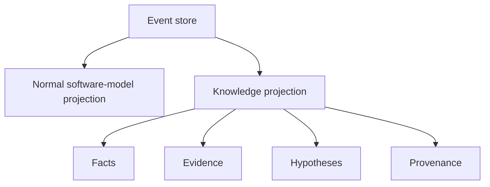

The event payload should preserve source service, confidence/score, revision, and evidence references so that a future fact/hypothesis projection can construct provenance. The normal projection should not require RDF libraries, triples, or hypothesis resolution. A `ConstantFact`, `FunctionIdMatch`, or `SwitchFact` can initially be an ordinary typed row and later be projected into a knowledge graph without changing the source event.

## Architectural Decisions

### 21.1 `core` versus `runtime`

**Decision:** domain values/contracts/events are core; lifecycle, workers, persistence, projects, and scheduling are runtime.

**Reason:** core must remain usable by services and future bindings without file handles, thread pools, or database ownership.

**Alternatives considered:** put a `Project`/`Program` object in core; retain current analyzer shared context as framework.

**Rejected because:** both create a central mutable dependency and make core depend on every service concern.

**Consequences:** more explicit query/writer adapters and event boundaries; implementation is more modular and replayable.

### 21.2 Service versus Provider

**Decision:** providers supply immutable/read-only capabilities; services perform active operations and produce results/proposals.

**Reason:** decompiler and FID need data without owning project persistence; a service contract makes lifecycle and resource use explicit.

**Alternatives:** one interface per every data category or one giant `IProgram` interface.

**Rejected because:** interface explosion duplicates concepts, while a giant interface recreates ProgramDB. Use `IProjectQuery` for current-model reads and narrow providers only for genuinely separate capabilities.

**Consequences:** services can be tested with in-memory providers and run concurrently against snapshots.

### 21.3 One shared native translation substrate

**Decision:** compile one private implementation of native address/space/translate/load-image/raw p-code classes for Sleigh and Decompiler.

**Reason:** the original Ghidra C++ code shares these classes, and current project has confirmed duplicate module names in both libraries.

**Alternatives:** keep two copies, or replace native algorithms with a new simplified p-code model.

**Rejected because:** two copies drift and may collide at link/runtime; simplification violates the 1:1 port requirement.

**Consequences:** build graph becomes more layered; public adapters must map native values to core values.

### 21.4 Sync versus async

**Decision:** one decode/query and small mutations may be synchronous; bulk decode, FID search, decompilation, and full analysis are asynchronous.

**Reason:** preserves interactive ergonomics without blocking on expensive operations.

**Alternatives:** everything async or everything single-threaded.

**Rejected because:** everything async harms simple use/tests; everything sync cannot handle GTA5-scale work or a future GUI.

**Consequences:** every expensive result has cancellation, progress, task identity, and lifetime rules.

### 21.5 Shared worker pool

**Decision:** one runtime-owned bounded pool with a simple priority/sequence queue; MVP analyzer work has one serial project lane and no quota/fairness subsystem.

**Reason:** Ghidra's `AutoAnalysisManager` already describes a shared analysis pool, and separate service pools oversubscribe CPU and complicate cancellation.

**Alternatives:** one pool per decompiler/FID/Sleigh service; OS process workers.

**Rejected because:** starvation/oversubscription and unnecessary process boundaries; native service instances remain isolated without separate pools.

**Consequences:** the MVP is straightforward but a long bulk task can reduce responsiveness; quotas, fair multi-project scheduling, and an interactive reservation are deferred until measured need.

### 21.6 Command versus event

**Decision:** commands are requests; responses are transient; typed significant changes are events.

**Reason:** a decode result or failed operation is not automatically durable history, while rename/function/type changes must survive reopen/replay.

**Alternatives:** event every p-code operation or use events as task RPC.

**Rejected because:** event volume and semantics become unmanageable; event bus is not a command transport.

**Consequences:** service outputs need explicit mutation commands and event policies.

### 21.7 Event store versus projection

**Decision:** append-only `events.log` is history; SQLite is replaceable current projection.

**Reason:** sequential append/replay is simple, while indexed current queries need different physical storage.

**Alternatives:** SQLite as sole source; custom mutable binary database; RDF as primary store.

**Rejected because:** sole projection storage loses replay/audit; custom database increases scope; RDF is intentionally future work.

**Consequences:** schema/event versioning and projection rebuild tooling are mandatory. In the MVP, `ProjectSession`/`ProjectionCoordinator` applies the projection synchronously after event append and before event-bus publication; the bus is never an alternative projection writer.

### 21.8 Project location

**Decision:** `Project` is a runtime lifecycle owner; `ProjectId`/config are core values.

**Reason:** project owns stores, resources, caches, services, workers, and close/reopen behavior.

**Alternatives:** a core `Project` domain aggregate or service-specific project contexts.

**Rejected because:** project is infrastructure composition, not a stable algorithm/domain primitive; multiple contexts would duplicate lifecycle rules.

### 21.9 Analyzer manager location

**Decision:** implementation in `services/analyzers`, manager/registry/scheduler in `runtime/analysis`.

**Reason:** current `AutoAnalysisManager` is orchestration and its state is unsynchronized; analyzers should be reusable services.

**Alternatives:** keep manager in analyzer feature or put all analyzers in runtime.

**Rejected because:** feature library becomes a framework dependency and business logic leaks into runtime.

**MVP consequence:** runtime owns one deterministic scheduler lane per project; moving analyzer code to service directories does not require concurrent analyzer execution.

### 21.10 Public C++ API

**Decision:** `bindings/cpp` is a facade above runtime; internals depend only on core/contracts.

**Reason:** one stable native API can serve applications and future bindings without creating a cycle.

**Alternatives:** make runtime itself the public API or make each language binding wrap services directly.

**Rejected because:** runtime internals would become ABI commitments; direct bindings multiply unstable adapters.

### 21.11 Storage

**Decision:** SQLite projection plus append-only framed binary event log.

**Reason:** SQLite is practical for millions of indexed instructions/functions/references; a binary log avoids JSON overhead and preserves replay.

**Alternatives:** JSON log, one custom binary database, SQLite event log, RDF store.

**Rejected because:** JSON volume/performance, custom scope, conflating history/current view, and premature knowledge-graph dependency.

## MVP Decisions and Deferred Review Findings

The MVP deliberately fixes correctness boundaries that affect replay or data loss and defers scalability/abstraction work that can be added without changing the event contract.

| Finding | MVP decision | Consequence / accepted risk |
| --- | --- | --- |
| MAJOR-001: event-log growth/compaction | **Defer.** Keep the append-only log, deterministic batch events, and current projection. Do not implement compaction or event snapshots yet. | Repeated full re-analysis can grow `events.log`; MVP accepts this while GTA5-scale batch sizing and real usage are measured. No event deletion API is allowed, so future compaction can be added safely. |
| MAJOR-002: analyzer snapshot/commit/order semantics | **Fix now.** One mutating analyzer proposal in flight per project; owned snapshot at revision `R`; private local overlay; all-or-nothing commit through one lane; coarse `base_revision == current_revision` conflict check; deterministic priority/ID/enqueue ordering; one retry, then diagnostic. | No parallel mutating analyzers or fine-grained conflict merging in MVP, but current order-sensitive behavior is deterministic and stale proposals cannot corrupt state. |
| MAJOR-003: projection versus event bus ownership | **Fix now.** `ProjectSession`/`ProjectionCoordinator` is the sole projection applier. `IEventStore` only appends/reads; `EventBus` only publishes after projection checkpoint. | There is one commit path and no duplicate projection subscriber. A crash between log append and projection apply is recovered by replay on open. |
| MAJOR-004: event schema completeness | **Fix now.** Use the closed state-event set in section 9.2.1 with explicit upsert, replace-scope, remove, invalidate, generation, supersession, and idempotency semantics. | The MVP avoids dozens of setter events while preserving current authoritative/derived collections and all meaningful update/delete/invalidation behavior. |
| MAJOR-005: concrete service dependency direction | **Defer broad inversion.** MVP CMake targets may link existing concrete feature libraries and compatibility adapters. Services still cannot write the event log/projection or expose concrete storage types through contracts. | The build graph remains less pure during migration, but no algorithm rewrite is required. Full dependency inversion is a later target-state cleanup. |
| MAJOR-006: overly broad core/domain | **Defer full narrowing.** Do not create a `Program`/database in core and do not add more domain types until at least two services need them. Existing FID/decompiler DTOs remain provisional contract values behind adapters. | Core may temporarily contain more DTOs than the minimal kernel, but it remains value-oriented and has no service logic, persistence, or global mutable state. |
| MAJOR-007: parallel decoder/resource strategy | **Constrain minimally.** MVP uses one project decoder protected by a mutex; the worker pool can queue bulk work but cannot execute native decode concurrently. | Throughput is limited, but native state races are avoided. A decoder pool is deferred until profiling proves it necessary. |
| MAJOR-008: artifact/resource reproducibility | **Fix now.** Persist SHA-256, size, format/schema version, logical ID, producer/parser version, required flag, and ordered `ResourceSetIdentity` for the executable, SLA/compiler spec, FID/PDB/GDT resources, and each analysis run. | Re-analysis fails explicitly on missing/mismatched resources; replay of already committed events remains possible in history-only mode. |
| MAJOR-009: snapshot semantics | **Fix now.** `AnalysisSnapshot` is an owned DTO copied from one projection read transaction at revision `R`, with immutable image/resource handles and explicit scope. It is not a live DB view or arbitrary historical query. | Snapshot capture copies data and may cost memory, but it is simple, implementable, and safe across task suspension. |
| MAJOR-010: multi-process project locking | **Defer.** MVP supports one open `ProjectSession` per project per process and documents concurrent process access as unsupported. | A second process may receive `ProjectAlreadyOpen` only when coordinated through the same runtime; OS file locking is a future hardening item. |
| MAJOR-011: async task/project lifetime | **Fix now.** Project generation, owned operation state, cooperative cancellation, close barrier, commit-lane state/generation validation, and no detached tasks. | Close waits for active tasks and rejects stale proposals, preventing use-after-close and commit-after-close. |

These MVP decisions supersede any earlier target-state wording that suggests parallel mutating analyzers, a projection event-bus subscriber, per-worker decoder leases, or implicit path/timestamp resource identity.

The current repository has no `runtime`, `ProjectSession`, event store, projection, dispatcher, or task-lifetime implementation yet. The existing `AutoAnalysisManager`/`AnalysisContext` path is already effectively serial and remains the compatibility implementation during migration. This decision pass therefore requires no source-code change: adding a partial event/snapshot layer without its commit coordinator would make the current implementation less coherent. The first implementation slice must introduce the MVP coordinator, event closure, and snapshot/proposal adapters together.

## Open Questions

These questions do not invalidate the architecture, but must be resolved during implementation with measurements or source study:

1. Which exact SLA/compiler-spec resource representation should be immutable/shared, and how should a future worker-local native `Sleigh` pool be constructed without reparsing the full file? The MVP uses one mutex-protected decoder.
2. Are current FID database query objects safe for concurrent reads? If not, should each worker open a read-only handle or should the database format be memory-mapped behind a synchronized query adapter?
3. Which decompiler native objects can be reused safely across requests? The safe baseline is one `Architecture`/`Funcdata` session per task.
4. Should p-code be normalized into SQLite rows or stored as canonical compressed blobs with an in-memory decode cache? Benchmark GTA5-scale query patterns before committing to a physical schema.
5. Which event batches are the right partition size for millions of instructions and references? The target must balance log append size, projection transaction time, cancellation granularity, and replay memory.
6. How much of the original Java datatype manager must be ported for PDB/data archives and decompiler type propagation? Start with a descriptor graph and add behavior only when a service contract requires it.
7. How should external libraries, forwarded exports, overlays, and multiple address spaces be represented in the initial PE projection while preserving the one-primary-executable Project assumption?
8. What exact public C++ ABI policy is needed before selecting pybind11, Node-API, or a Go C shim? Keep the C++ module API source-stable first; freeze ABI later.
9. Should decompiler text/results be cached as projection data, a derived cache, or both? Cache invalidation must use function/prototype/p-code/type revisions.
10. Which analyzers can safely run concurrently in a future release? The MVP serializes all mutating analyzer proposals and treats current ordering as authoritative.

## Risks

| Risk | Impact | Mitigation |
| --- | --- | --- |
| Native Sleigh/decompiler consolidation changes module/link behavior | Build or semantic regressions | Establish one shared native target, retain original tests, compare decode/decompiler outputs and symbol mappings before removing compatibility targets. |
| Address-space conversion loses native pointer/constant semantics | Incorrect p-code, FID hashes, or decompilation | Treat `AddressSpaceId` and `StorageLocation` as mandatory; test constant/register/unique/stack/overlay cases against original contracts. |
| Projection schema becomes a new giant database dependency | Services become coupled to SQLite and hard to replay | Keep `IProjectQuery`/mutation contracts above storage, use narrow snapshots, and forbid service SQL. |
| Event volume is too large for GTA5.exe | Slow import/replay or disk exhaustion | Use deterministic batch events and compact p-code blobs; benchmark with real-size fixtures; keep projection rebuild streaming. |
| Event and projection revisions diverge | Incorrect reopen or analyzer scheduling | Append before publish, one writer, idempotent event IDs, checkpoint after apply, and crash/replay tests. |
| Analyzer proposals are stale when committed | Lost updates or invalid references | Include read revision, expected entity revisions, validation, bounded conflict retry, and diagnostics. |
| Shared pool starvation | UI/decompiler responsiveness degrades during analysis | MVP uses a bounded priority/sequence queue and one serial analyzer lane; quotas/fairness are deferred, while cancellation and backpressure remain required. |
| Stateful native engines are used concurrently | Data races or corrupted caches | MVP serializes the project decoder with a mutex and gives each decompiler task its own native `Architecture`/`Funcdata`; decoder pools are deferred. |
| Current analyzers depend on direct mutation ordering | Behavior changes during migration | First wrap existing mutators as event-producing adapters, compare fingerprints/events, then migrate one analyzer family at a time. |
| Text parsing remains the only decompiler integration | Weak structured projection and fragile switch analysis | Add structured decompiler result types while retaining text compatibility artifacts. |
| FID preloading delays project readiness excessively | Poor user experience | Make warm-up policy configurable, report progress, permit lazy optional DBs, and preserve deterministic query order. |
| Binding ABI freezes internal types too early | Future language integration becomes costly | Expose opaque handles and core serializable values; do not expose native engine or SQLite types. |

## Assumptions

1. Initial scope is one primary `.exe` per `Project`, although the artifact model can later support auxiliary files/libraries.
2. C++23 modules, MSVC, CMake, Ninja, vcpkg, GoogleTest, and the repository's build wrappers remain the supported toolchain.
3. The original Ghidra Java and native C++ sources remain available in this repository as port references and are not runtime dependencies of the final C++ system.
4. The first conventional projection is sufficient for current users; RDF/fact/hypothesis storage is a future projection, not a prerequisite.
5. A project is an in-process object; no network service boundary is required.
6. The event log is authoritative for project history, but input artifact bytes remain an external/managed resource and are not necessarily copied into the log.
7. Service results are immutable snapshots/proposals. A service may maintain private caches but cannot mutate another service's state or projection.
8. Existing feature-local tests and port evidence are preserved and expanded as modules move; no algorithm is intentionally simplified to fit the architecture.
9. All new source and test comments/documentation required by `AGENTS.md` will be added during implementation, including original-source references and meaningful comments before declarations.
10. The current analyzer priorities and observable Ghidra compatibility behavior are retained unless a documented source comparison proves a correction is required.

## 25. Implementation Order

The following order minimizes architectural risk while preserving a working build at each stage:

1. Create core identifiers, diagnostics, bytes, address spaces, address/ranges, storage, p-code, instruction, reference, memory, function, symbol, datatype, and architecture values with serialization tests.
2. Create core contracts and adapters from current `sleigh_runtime`, PE, decompiler, and analyzer types. Keep compatibility conversions temporarily, but establish one canonical direction.
3. Extract the duplicated native translation modules into one target and make both Sleigh and Decompiler link it. Compare all existing focused tests.
4. Move PE/FID/Sleigh/decompiler public facades to service targets without changing algorithm behavior.
5. Implement runtime workers, owned operation state, cancellation, close generation, and dispatcher. Replace direct FID `std::async` with pool submission while keeping non-reentrant resources serialized.
6. Implement the closed MVP event envelope/state-event codecs, append-only log, and recovery tests.
7. Implement the `ProjectSession`/`ProjectionCoordinator` commit lane: append drafts, apply projection, checkpoint, then publish non-projection bus notifications.
8. Implement SQLite projection and a projection fingerprint/replay test against the current analyzer final-state fingerprint.
9. Implement `Project` open/close/resource manifest validation and initial `LoadPrimaryBinary` command.
10. Move analyzer registry/scheduling into runtime while initially adapting analyzers to the owned `AnalysisSnapshot`/private-overlay/proposal bridge.
11. Migrate disassembly, reference, data, function, symbol, and bookmark mutations to typed commands/events.
12. Migrate FID, PDB, signatures, decompiler parameter/switch, stack, and type mutations after structured domain values are complete.
13. Add public C++ facade, CLI integration, and future binding scaffolding only after runtime contracts are stable.
14. Add full GTA5-scale integration, cancellation/reopen/replay, deterministic-order, and resource-identity tests; defer multi-process and parallel-decoder tests until their features are intentionally introduced.

This sequence is intentionally incremental. It does not authorize code changes in this research task; it defines the order for a later implementation agent.
